\begin{center}
\includegraphics[width=0.72\textwidth]{docs/images/image104.png}\\[1.0cm]

{\normalsize Investigación Económica II — Ciclo 2026-I}\\[1.5cm]

{\LARGE \textbf{Informalidad y Distribución de Riqueza:}\\[0.2cm]
Un Modelo de Agentes Heterogéneos con Oferta Laboral Endógena}\\[1.5cm]

{\normalsize \textbf{Presentado por:}\\[0.2cm]
John Svante Barraza Ratachi\\
Enzo Andrés Nevado Martínez}\\[0.8cm]

{\normalsize \textbf{Asesor:} César Saturnino Salinas Depaz}\\[0.8cm]

{\normalsize Lima, Junio 2026}
\end{center}

\newpage

# RESUMEN

La economía peruana exhibe una elevada informalidad laboral (71.1% en 2023 según INEI–ENAHO) junto a una marcada desigualdad de riqueza. Esta tesis analiza cómo la decisión endógena de los hogares de asignar horas de trabajo entre los sectores formal e informal afecta la distribución estacionaria de riqueza y consumo. Para ello, se desarrolla un modelo macroeconómico de equilibrio general con agentes heterogéneos en tiempo continuo, extendiendo Achdou et al. (2022) mediante una estructura productiva dual y oferta laboral endógena en el margen intensivo.

El objetivo es cuantificar los efectos de la informalidad sobre la distribución de riqueza, no explicar sus causas. El modelo utiliza únicamente datos agregados, evitando requerimientos de microdatos individuales. La hipótesis central sostiene que la informalidad genera un mecanismo de baja acumulación para agentes de menor riqueza, acentuando la desigualdad. Dicho mecanismo combina supuestos de diseño (barreras de acceso decrecientes en productividad, prima de deuda diferencial) con resultados endógenos que emergen del equilibrio general (sorting laboral, acumulación patrimonial diferencial, retroalimentación entre informalidad y baja riqueza).

La calibración final replica razonablemente los agregados primarios: T4 (fracción de horas informales) = 51.7% frente a un promedio pre-COVID de 50.9% (2015-2019), T5 (PBI informal) = 18.8% (dato: 19.0%) y Tkz = 37.8% (dato: 38.6%). Como robustez, el promedio T4 para años COVID/post disponibles excluyendo 2021 es 55.9%, frente al cual el modelo queda 4.2 puntos porcentuales por debajo. El modelo subestima el gradiente de informalidad por quintil de riqueza (T6 del modelo = 4.4% vs. dato = 53.0%), lo cual se atribuye a la ausencia del margen extensivo. Adicionalmente, la oferta laboral endógena actúa como canal de auto-aseguramiento parcial frente a shocks de productividad, reduciendo (pero no eliminando) la severidad del mecanismo de baja acumulación.

**Palabras Clave**: Informalidad, Distribución de la Riqueza, Agentes Heterogéneos, Oferta Laboral Endógena, Tiempo Continuo, Macroeconomía, Perú, Proceso OU, Diferencias Finitas.

\newpage

# ABSTRACT

The Peruvian economy exhibits high labor informality (71.1% in 2023, according to INEI-ENAHO), alongside marked wealth inequality. This thesis analyzes how households' endogenous decision to allocate working hours between the formal and informal sectors affects the stationary distribution of wealth and consumption. A continuous-time general equilibrium model with heterogeneous agents is developed, extending Achdou et al. (2022) through a dual productive structure and endogenous labor supply at the intensive margin.

The objective is to quantify the effects of informality on wealth distribution, rather than to explain its structural causes. The model uses only aggregate data. The central hypothesis posits that informality generates a low-accumulation mechanism for lower-wealth agents, exacerbating inequality. This mechanism combines design assumptions (productivity-decreasing access barriers, differential debt premium) with endogenous results that emerge from general equilibrium (labor sorting, differential wealth accumulation, feedback between informality and low wealth).

The final calibration replicates the main aggregates reasonably well: T4 (informal hours share) = 51.7% against a pre-COVID average of 50.9% (2015-2019), T5 (informal GDP) = 18.8% (data: 19.0%), and Tkz = 37.8% (data: 38.6%). As a robustness check, the T4 average for available COVID/post-COVID years excluding 2021 is 55.9%, relative to which the model is 4.2 percentage points lower. The model undershoots the informality gradient by wealth quintile (model T6 = 4.4% vs. data = 53.0%), attributed to the absence of the extensive margin. Additionally, endogenous labor supply acts as a partial self-insurance channel against productivity shocks, reducing (but not eliminating) the severity of the low-accumulation mechanism.

**Keywords**: Informality, Wealth Distribution, Heterogeneous Agents, Endogenous Labor Supply, Continuous Time, Macroeconomics, Peru, OU Process, Finite Differences.

\newpage

# 1. INTRODUCCIÓN

La economía peruana presenta una marcada dualidad estructural en su mercado laboral, caracterizada por la coexistencia de un amplio sector informal que, en términos de empleo, supera ampliamente al sector formal. Según datos del Instituto Nacional de Estadística e Informática (INEI), en 2025 la tasa de empleo informal alcanzó el 70.2% (INEI, 2025). Esta cifra sitúa a Perú entre las economías con mayor grado de informalidad a nivel global, superando ampliamente el promedio de América Latina y el Caribe, estimado en 47.6% para 2024 (OIT, 2024). Esta dualidad también se refleja en los salarios: el salario promedio formal fue S/ 2,903 mientras el informal apenas S/ 1,099 en 2023 (ComexPerú, 2024).

La informalidad en el Perú no es un fenómeno reciente ni atemporal. Sus raíces se remontan a las profundas transformaciones estructurales de la segunda mitad del siglo XX. Durante las décadas de 1960 y 1970, la migración masiva del campo a la ciudad aceleró el crecimiento urbano, especialmente en Lima Metropolitana. Como documenta Matos Mar (1984), Lima albergaba en 1981 el 41% de la población urbana del país y el 27% de la población total; hacia julio de 1984, concentraba cerca del 50% de la población urbana nacional y más del 30% de la población total del Perú. Además, según el censo de 1981, el 41% de la población limeña era migrante, y de ese grupo el 54% provenía de la sierra. Esta concentración demográfica sometió al mercado laboral urbano y a las estructuras sociales de la capital a presiones sin precedentes. El sector formal, limitado por una industrialización insuficiente y por un aparato estatal con escasa capacidad de integración, no logró absorber plenamente a esta nueva fuerza laboral. En respuesta, amplios sectores migrantes recurrieron a formas de autoorganización económica y urbana, como barriadas, comercio ambulatorio y otras actividades extralegales, que constituyeron una base importante del sector informal urbano moderno.

La crisis económica de los años ochenta, marcada por hiperinflación, caída del PBI per cápita y deterioro del mercado laboral, consolidó este patrón. Según Rossini (2015), el PBI real per cápita del Perú cayó alrededor del 30% hacia fines de la década. En ese contexto, De Soto (1986) argumentó que la informalidad no era simple marginalidad, sino una respuesta popular frente a un Estado que cerraba el acceso a la formalidad mediante barreras burocráticas desproporcionadas: abrir un taller industrial podía requerir 289 días de trámites, y adjudicar un terreno eriazo tomaba casi siete años. Aunque la economía peruana se estabilizó y creció durante el ciclo expansivo asociado al auge de commodities de mediados de los 2000, la reducción de la informalidad fue limitada: el empleo informal no agrícola pasó de 75.0% en 2004 a 68.6% en 2012 (OIT). Según la Cuenta Satélite del INEI, en 2023 el sector informal representaba el 18.3% del PBI y el 71.1% de la PEA ocupada tenía empleo informal (INEI, 2024; OIT, 2025; INEI, 2025). Incluso restringiendo el análisis al empleo no agropecuario, la informalidad alcanzaba 64.4% en 2023. En consecuencia, la informalidad peruana debe entenderse como un fenómeno con raíces históricas, sensible a los ciclos económicos, pero con fuerte inercia estructural.

Por otro lado, la información estadística disponible en Perú se concentra principalmente en ingresos y gastos de los hogares, pero no existen mediciones sistemáticas de la riqueza a nivel individual. La riqueza constituye un concepto más amplio que el ingreso e incluye ahorros, propiedades y demás activos que conforman el patrimonio neto. Esta distinción resulta relevante ya que los ahorros y el acceso al crédito desempeñan un papel fundamental en la capacidad de los hogares para suavizar su consumo frente a shocks económicos (Hallegatte, 2014).

La principal barrera para estudiar la distribución de la riqueza en Perú es la escasez de data microeconómica de alta calidad que vincule, a nivel de hogar, ingresos, empleo (formal/informal) y detalle de activos y pasivos. Una estimación econométrica directa que relacione informalidad y riqueza a nivel individual sería, por tanto, extremadamente compleja por limitaciones de datos y problemas de endogeneidad. Por ello, se opta por un modelo macroeconómico de equilibrio general con agentes heterogéneos (HA) en tiempo continuo, que no requiere data micro de riqueza desagregada, sino inputs agregados y parámetros calibrados o tomados de la literatura macroeconómica.

La pregunta central que guía este trabajo es: **¿Cómo afecta la decisión de los hogares de asignar horas de trabajo entre sectores formal e informal a la distribución de riqueza y consumo en un modelo de Agentes Heterogéneos?**

La hipótesis inicial plantea que la informalidad puede contribuir a un **mecanismo de baja acumulación**: los hogares con menor riqueza y productividad dependen más de actividades de menor remuneración, lo que limita su capacidad de ahorro y acumulación de activos. Sin embargo, el objetivo es cuantificar los efectos de la informalidad sobre la distribución de riqueza, mas no explicar de manera integral sus causas estructurales. Esto último requeriría modelar dimensiones adicionales como educación, capital humano, regulación, institucionalidad y, especialmente, la decisión de participar o no en uno u otro sector (margen extensivo), lo cual excede el alcance del presente trabajo.

El modelo se concentra en el **margen intensivo** de la oferta laboral: los hogares eligen cuánto trabajar y cómo distribuir sus horas entre el sector formal y el informal, dados sus activos, productividad y precios de equilibrio. Esta estrategia permite estudiar la interacción entre heterogeneidad, ahorro, consumo y oferta laboral en un mercado dual, aunque también impone una limitación importante: no modela la decisión discreta de participar o no en cada sector.

La importancia de este trabajo es triple. Primero, contribuye a la macroeconomía cuantitativa aplicando modelos de agentes heterogéneos en tiempo continuo a una economía emergente como Perú. Segundo, contribuye a entender los canales por los cuales la informalidad afecta la distribución de riqueza a nivel macroeconómico. Tercero, aporta a la discusión empírica sobre la distribución de riqueza en Perú, un aspecto poco analizado debido a la limitada disponibilidad de información estadística.

El documento se estructura de la siguiente manera. En la Sección 2, se revisa la literatura sobre informalidad, desigualdad y acumulación de riqueza. En la Sección 3, se presenta el marco analítico del modelo. En la Sección 4, se desarrolla la metodología de calibración y solución numérica. En la Sección 5, se exponen los resultados. En la Sección 6, se discuten los mecanismos del modelo, la trampa de pobreza, el canal de seguro y las limitaciones. Finalmente, se presentan las conclusiones y bibliografía.

\newpage

# 2. REVISIÓN LITERARIA

El mercado laboral peruano, al igual que en gran parte de América Latina, se caracteriza por una alta incidencia de la informalidad con implicancias directas sobre la distribución de ingresos y, en consecuencia, sobre la acumulación de riqueza (Gomes, Iachan y Santos, 2020). Engbom et al. (2022), al estudiar Brasil, encuentran que los trabajadores informales reciben salarios sistemáticamente más bajos que sus pares formales. De forma complementaria, Gomes et al. (2020) documentan que cada cambio hacia la informalidad supone un choque negativo significativo sobre los ingresos.

Las diferencias en ingresos no solo afectan el bienestar corriente sino también las posibilidades de ahorro y acceso al sistema financiero. Granda (2015), al estudiar Colombia, observa que los hogares con empleo informal presentan menores niveles absolutos de ahorro, aunque ahorran una mayor fracción de sus ingresos como mecanismo de protección frente al riesgo. Flabbi y Tejada (2022) muestran que los trabajadores informales tienen una probabilidad significativamente menor de acceder a crédito bancario.

La relación entre informalidad y acceso al crédito puede entenderse a partir de la literatura sobre información asimétrica en mercados financieros. Bajo estos escenarios, las entidades financieras no observan perfectamente el riesgo de repago ni las acciones futuras de los prestatarios. En el marco de Stiglitz y Weiss (1992), esta asimetría puede generar racionamiento de crédito en equilibrio, ya que las tasas de interés y los requerimientos de colateral afectan tanto la composición de solicitantes como los incentivos de quienes reciben financiamiento. Cerqueiro, Degryse y Ongena (2011) documentan una dispersión importante en las tasas de crédito otorgadas a prestatarios aparentemente similares, asociada a la discrecionalidad de los oficiales de crédito, especialmente en préstamos pequeños y sin colateral.

Estas restricciones financieras adquieren particular relevancia cuando se analizan sus efectos sobre la acumulación de riqueza. Buera, Kaboski y Shin (2011) modelan la elección ocupacional y el emprendimiento en una economía donde los individuos difieren en riqueza y talento empresarial, y enfrentan restricciones financieras asociadas a colateral y cumplimiento imperfecto de contratos. En este marco, las fricciones financieras distorsionan la asignación de capital y talento: individuos productivos pero con baja riqueza pueden retrasar su entrada al emprendimiento o operar por debajo de su escala eficiente, mientras que agentes con mayor riqueza pueden sostener actividades empresariales aun cuando su productividad sea menor. Como resultado, las restricciones crediticias generan mala asignación de recursos, reducen la productividad agregada y contribuyen a la persistencia de diferencias patrimoniales.

En la misma dirección, Albertini, Fairise y Terriau (2020) estudian Sudáfrica mediante un modelo HA de ciclo de vida con sectores formal e informal, estimado con datos del National Income Dynamics Study. Los autores muestran que la interacción entre riesgos de salud y trayectorias laborales afecta de manera significativa la riqueza y el consumo a lo largo del ciclo de vida. En particular, los trabajadores informales son más vulnerables a shocks de salud, pues estos aumentan la probabilidad de transición hacia el no empleo y reducen las posibilidades de reinserción laboral. Además, el modelo reproduce que la acumulación de riqueza a lo largo del ciclo de vida es menor entre trabajadores informales que entre trabajadores formales.

Dentro de esta línea, Galindo et al. (2024, BCRP) desarrollan un modelo HACT calibrado para Perú que incorpora informalidad mediante dos tipos de agentes clasificados ex-ante, formales e informales, que difieren en su acceso al crédito, obligaciones tributarias y aversión al riesgo. Sus resultados muestran que un sector informal amplio reduce el nivel agregado de riqueza y aumenta su desigualdad. Este trabajo constituye la **referencia principal** para el modelo presentado en esta investigación, el cual lo extiende en varias dimensiones: incorpora oferta laboral endógena, consumo CES con precio endógeno del bien informal, una prima de deuda dependiente de la productividad y un proceso de difusión tipo Ornstein-Uhlenbeck para la productividad (AR(1) en tiempo continuo).

La incorporación de decisiones de oferta laboral resulta particularmente relevante porque los hogares utilizan el trabajo como mecanismo adicional para suavizar fluctuaciones en sus ingresos. Heathcote, Storesletten y Violante (2009) presentan una revisión exhaustiva destacando las distintas fuentes de riesgo idiosincrático y los mecanismos de aseguramiento disponibles, entre ellos la oferta laboral. Pijoan-Más (2006) encuentra que el ahorro precautorio **disminuye** cuando la oferta laboral es flexible, ya que los hogares pueden usar las horas trabajadas como mecanismo de ajuste frente a shocks de ingreso. Marcet, Obiols-Homs y Weil (2007) muestran que la incorporación de oferta laboral endógena puede modificar sustancialmente los resultados tradicionales de los modelos HA. Más recientemente, Bacher, Grübener y Nord (2025) analizan cómo la participación laboral adicional funciona como un mecanismo de auto-aseguramiento frente a choques negativos de ingresos.

Los mecanismos descritos han sido interpretados a través de dos grandes paradigmas teóricos. El enfoque **estructuralista** (CEPAL, PREALC/OIT, Prebisch, Pinto, Tokman) interpreta la informalidad como resultado de la coexistencia entre un sector moderno de alta productividad y un conjunto amplio de actividades de baja productividad que no logran ser absorbidas por dicho sector. Aunque Prebisch (1949) no formula una teoría explícita de la informalidad, su análisis de la difusión desigual del progreso técnico constituye uno de los antecedentes centrales de esta visión. Posteriormente, Pinto (1970), PREALC/OIT e Infante desarrollan la noción de heterogeneidad estructural para explicar la persistencia de actividades de baja productividad y subsistencia.

El enfoque **institucional** (De Soto, Loayza, Banco Mundial) enfatiza el papel de la regulación, los costos de formalidad y la relación entre Estado y agentes privados. De Soto (1986) destaca las barreras burocráticas, la debilidad de los derechos de propiedad y los costos de acceso a la legalidad como factores que empujan a amplios sectores de la población hacia actividades extralegales. Loayza (2016) plantea que la informalidad puede surgir tanto por exclusión como por decisión voluntaria de los agentes cuando perciben que los costos de cumplir con la regulación superan los beneficios asociados a la formalidad.

El modelo propuesto incorpora elementos de ambos enfoques. Del paradigma estructuralista toma la existencia de diferencias de productividad entre sectores (tecnologías distintas). Del enfoque institucional incorpora una barrera de acceso al sector formal $\kappa(z)$ y una prima de deuda $\text{spread}(z)$, que actúan como aproximaciones a costos regulatorios, financieros y de acceso que enfrentan los agentes de menor productividad.

Más allá de estos mecanismos generales, la evidencia para Perú muestra dimensiones importantes de heterogeneidad. Los datos de INEI-EPEN (2024) muestran que la informalidad laboral femenina supera a la masculina, y Guillén y Huarancca (2024) documentan brechas salariales persistentes que se amplían en contextos de vulnerabilidad, como el empleo informal o la presencia de niños pequeños en el hogar. Aunque el modelo actual no incorpora explícitamente diferencias por género, esta evidencia sugiere que las fricciones asociadas a la informalidad afectan de manera heterogénea a distintos grupos de la población.

La informalidad también presenta una marcada heterogeneidad sectorial. Según la EPEN 2024, la mayor incidencia de empleo informal se registra en el sector primario, seguido por construcción, comercio, manufactura y servicios. Dado el peso del sector primario en el empleo nacional y sus elevados niveles de informalidad, este concentra una proporción significativa del empleo informal total del país. Aunque el modelo agrega todas las actividades informales en una única tecnología con rendimientos decrecientes, esta simplificación constituye una limitación reconocida y abre la posibilidad de futuras extensiones con sectores informales diferenciados.

En síntesis, la literatura coincide en que la informalidad constituye un factor relevante en la generación y persistencia de desigualdades económicas. La evidencia muestra que los trabajadores informales perciben menores ingresos, enfrentan mayores restricciones financieras y suelen operar en actividades de menor productividad, factores que limitan la acumulación de riqueza y reducen las posibilidades de movilidad económica. No obstante, gran parte de las investigaciones se ha concentrado en la relación entre informalidad e ingresos, mientras que la conexión entre informalidad y distribución de la riqueza ha recibido menor atención, particularmente en economías emergentes como la peruana.

\newpage

# 3. MARCO ANALÍTICO

Para el desarrollo del estudio se optó por un modelo de agentes heterogéneos, dado que la estimación econométrica de relaciones causales requeriría información escasa, especialmente sobre activos financieros (ahorros, inversiones y deudas) y activos no financieros (vivienda, bienes durables y patrimonio empresarial). La aplicación de un modelo HA permite representar de manera aproximada la realidad peruana sin necesidad de datos microeconómicos detallados de riqueza, utilizando información agregada para calibrar los parámetros.

Se plantea un modelo de equilibrio general con agentes heterogéneos diseñado para capturar tres características de la economía peruana: (i) un mercado laboral dual con sectores formal e informal; (ii) fricciones de acceso al sector formal y al crédito que dependen de la productividad; y (iii) decisiones endógenas de consumo, ahorro y asignación de horas laborales.

## 3.1 El Modelo Base: Agentes Heterogéneos en Tiempo Continuo

El punto de partida es un modelo neoclásico de mercados incompletos, en la tradición de Aiyagari (1994) y Huggett (1993), adaptado a tiempo continuo. Esta elección metodológica, popularizada por Achdou et al. (2022), ofrece ventajas sustanciales en términos de tratabilidad analítica y eficiencia computacional, lo cual resulta crucial para resolver modelos con distribución de riqueza y productividad.

En este paradigma, cada hogar enfrenta una secuencia de decisiones intertemporales bajo incertidumbre. En cada instante observa su riqueza $a$ y su productividad $z$, decide cuánto consumir y cuánto ahorrar, y toma como dados los precios agregados. Si el hogar recibe un shock favorable de productividad, aumenta su ingreso laboral potencial y puede acumular activos con mayor facilidad; si recibe un shock desfavorable, reduce ahorro, consume parte de sus activos o se endeuda hasta el límite permitido. El mecanismo central del modelo base es, por tanto, la interacción entre riesgo idiosincrático no asegurable, ahorro precautorio y restricción de endeudamiento.

La dinámica de la economía se resume en dos ecuaciones diferenciales parciales acopladas. La primera es la Ecuación de Hamilton-Jacobi-Bellman (HJB), que describe el problema de optimización dinámica de un hogar individual que toma precios como dados. La HJB determina las reglas de decisión: cuánto consumir y cómo ajustar la riqueza para cada combinación de activos y productividad. La segunda es la Ecuación de Kolmogorov Forward (KF), también conocida como Fokker-Planck, que toma esas reglas de decisión y calcula cómo se desplaza la masa de hogares dentro del espacio de estados. Si muchos hogares pobres tienen bajos ingresos y poca capacidad de ahorro, la distribución estacionaria concentra más masa en niveles bajos de riqueza; si algunos hogares reciben shocks positivos persistentes, se desplazan hacia niveles mayores de activos.

El equilibrio general cierra el modelo porque la suma de decisiones individuales debe ser compatible con los mercados agregados. La oferta de ahorro de los hogares determina el capital disponible; la demanda de capital de las firmas determina la tasa de interés; y la tasa de interés vuelve a afectar las decisiones de ahorro de los hogares. El equilibrio estacionario se obtiene cuando las políticas individuales, la distribución de hogares y los precios agregados son mutuamente consistentes. En la extensión de esta tesis, ese mismo mecanismo se mantiene, pero la decisión laboral se abre en dos sectores: formal e informal.

## 3.2 Nuestra Extensión del Modelo

La economía está poblada por un continuo de hogares heterogéneos que enfrentan riesgo idiosincrático no asegurable sobre su productividad laboral. La contribución central es la modelación explícita de la decisión laboral endógena en un mercado dual. A diferencia de los modelos estándar donde la oferta de trabajo es inelástica, en este marco los agentes eligen óptimamente cómo distribuir su tiempo total entre el trabajo en el sector formal y el trabajo en el sector informal.

### 3.2.1 Hogares Heterogéneos

A pesar de su heterogeneidad ex post, los hogares son **ex ante idénticos**: comparten la misma función de utilidad, el mismo proceso estocástico de productividad y el mismo acceso a los mercados. La heterogeneidad distributiva emerge endógenamente de las distintas realizaciones del shock $z$ y las decisiones óptimas de ahorro a lo largo del tiempo.

Los hogares son heterogéneos en sus dotaciones de activos $a$ y en su productividad laboral idiosincrática $z$. Específicamente, $a \in [a_{\min}, a_{\max}]$ representa la riqueza neta del hogar (activos financieros menos deuda), y $z \in \mathbb{R}_{+}$ es la productividad laboral idiosincrática del hogar, que evoluciona según un proceso de difusión Ornstein-Uhlenbeck (OU) en tiempo continuo — equivalente a un AR(1) anualizado con persistencia $\rho_z = 0.861$ y desviación estándar $\sigma_{\log z} = 0.544$ (Hong, 2022). En cada instante, el hogar elige: consumo de bienes formales $c_F \geq 0$ e informales $c_I \geq 0$ (siendo $p_I$ el precio relativo del bien informal); y horas de trabajo en el sector formal $\ell_F \geq 0$ e informal $\ell_I \geq 0$. La informalidad no se interpreta como una característica fija, sino como el resultado endógeno de la asignación óptima de trabajo.

Sin embargo, el acceso al sector formal no es inmediato ni gratuito. El modelo incorpora un costo de entrada al empleo formal que representa como proxy barreras asociadas a requisitos educativos, procesos de selección, costos de formalización y fricciones de contratación. Dicho costo depende negativamente de la productividad individual, de manera que los hogares más productivos enfrentan menores barreras. Formalmente:

$$
\kappa(z) = \kappa_{z1} \left(\frac{z_{\max} - z}{z_{\max} - z_{\min}}\right)^{\text{shape}}
$$

donde $\kappa_{z1}$ representa el costo máximo (agentes de baja productividad) y shape determina la curvatura.

El ingreso de los hogares proviene de cinco fuentes: (i) rendimiento de activos, (ii) ingresos laborales formales, (iii) ingreso laboral informal, (iv) participación en beneficios del sector informal y (v) transferencias del gobierno. La restricción presupuestaria intertemporal es:

$$
\dot{a} = (1-\tau) w_F z \ell_F + \left(w_I + \frac{\Pi_I}{L_I}\right) \theta z^{\nu_I} \ell_I + r(z) a + T - c_F - p_I c_I
$$

donde $r(z) = r - \text{spread}(z) \cdot \mathbf{1}[a < 0]$ incorpora la prima de deuda:

$$
\text{spread}(z) = \chi \left(\frac{z_{\max} - z}{z_{\max} - z_{\min}}\right)^{\eta}
$$

El consumo agregado se modela mediante una función CES entre bienes formales e informales:

$$
C(c_F, c_I) = \left[\omega_C \, c_F^{\rho_C} + (1-\omega_C) c_I^{\rho_C}\right]^{1/\rho_C}, \quad \rho_C = 1 - \frac{1}{\sigma_C}
$$

La utilidad del hogar, con utilidad separable en el trabajo de cada sector:

$$
u(C, \ell_F, \ell_I) = \frac{C^{1-\gamma} - 1}{1-\gamma} - \psi_F \frac{\ell_F^{1+1/\phi}}{1+1/\phi} - \psi_I \frac{\ell_I^{1+1/\phi}}{1+1/\phi}
$$

La **separabilidad** entre consumo y oferta laboral en cada sector implica que las condiciones de primer orden son independientes entre sí, lo que permite resolver la oferta laboral óptima analíticamente dada la utilidad marginal de la riqueza $V_a$:

$$
\ell_F^* = \left(\frac{V_a (1-\tau) w_F z}{\psi_F}\right)^{\phi}, \qquad \ell_I^* = \left(\frac{V_a w_I \theta z^{\nu_I}}{\psi_I}\right)^{\phi}
$$

### 3.2.2 Firma Formal

Opera en un entorno competitivo con tecnología Cobb-Douglas de retornos constantes a escala:

$$
Y_F = A_F K^{\alpha_K} L_F^{1-\alpha_K}
$$

donde $A_F = 1$ (normalización), $K$ es el **capital formal** y $L_F$ el trabajo formal agregado. El problema de optimización determina los precios de equilibrio:

$$
w_F = (1-\alpha_K) A_F \left(\frac{\alpha_K A_F}{r + \delta}\right)^{\alpha_K/(1-\alpha_K)}
$$

La firma cumple sus obligaciones tributarias con tasa $\tau$ sobre la nómina formal.

### 3.2.3 Firma Informal

La firma informal opera con tecnología que utiliza trabajo y capital informales:

$$
Y_I = p_I \cdot A_I K_I^{\alpha_I} L_I^{\beta_I}
$$

con $\alpha_I + \beta_I \leq 1$ (rendimientos decrecientes o constantes a escala). Los beneficios $\Pi_I = (1 - \beta_I) p_I Y_I / (\alpha_I + \beta_I)$ se distribuyen a los hogares de manera proporcional a sus horas informales. El precio relativo $p_I$ se determina endógenamente para vaciar el mercado de bienes informales: $C_I = Y_I$.

### 3.3 Gobierno

El gobierno recauda el impuesto sobre la nómina formal y redistribuye como transferencia de suma alzada:

$$
T = \tau \cdot w_F \cdot L_F
$$

garantizando la restricción presupuestaria balanceada $\int T \, d\mu = \int \tau w_F z \ell_F \, d\mu$.

\newpage

# 4. METODOLOGÍA

## 4.1 Calibración

### Parámetros de la Literatura

La Tabla 1 presenta los parámetros obtenidos directamente de la literatura o fijados por convenciones estándar.

**Tabla 1: Parámetros de la literatura**

| Parámetro | Símbolo | Valor | Fuente |
| :--- | :--- | :--- | :--- |
| Coef. aversión al riesgo | $\gamma$ | 1 | Achdou et al. (2022) |
| Tasa de descuento subjetiva | $\rho$ | 0.073 | PWT 11.0, K/Y Perú |
| Elasticidad de Frisch | $\phi$ | 0.38 | Céspedes & Rendón (2012, BCRP) |
| Tasa de depreciación | $\delta$ | 0.10 | Castillo & Rojas (BCRP REE-28) |
| Participación capital formal | $\alpha_K$ | 0.573 | Céspedes et al. (2014, BCRP) |
| Tasa impositiva formal | $\tau$ | 0.18 | Galindo et al. (2024, BCRP) |
| Dotación de tiempo | $\bar{H}$ | 1 | Normalización |
| Peso CES formal | $\omega_C$ | 0.56 | Calibración interna |
| Elasticidad sustitución CES | $\sigma_C$ | 5 | Calibración interna |
| Persistencia proceso $z$ | $\rho_z$ | 0.861 | Hong (2022, J. Int. Econ.) |
| Desviación estándar $\log z$ | $\sigma_{\log z}$ | 0.544 | Hong (2022, J. Int. Econ.) |
| Prima de deuda: magnitud | $\chi$ | 0.02 | Galindo et al. (2024, BCRP) |
| Prima de deuda: curvatura | $\eta$ | 1.0 | Supuesto conservador |
| Tecnología informal | $\alpha_I, \beta_I$ | 0.22, 0.619 | Göbel et al. (2013) |
| Atenuación shock informal | $\nu_I$ | 0.6 | Calibración interna |
| Atenuación $z$ en informal | $\theta$ | 1.0 | Sin atenuación adicional |

**Nota sobre ρ y r\*:** En modelos de Aiyagari (mercados incompletos), r\* < ρ en estado estacionario. El modelo arroja r\* = 0.066, consistente con ρ = 0.073. Un valor ρ = 0.05 daría r\* < 0.05, inconsistente con los resultados obtenidos.

**Nota sobre el proceso OU:** A diferencia de los procesos de Poisson de dos estados usados en literatura temprana, el modelo utiliza un proceso de difusión Ornstein-Uhlenbeck (OU) en tiempo continuo, equivalente a un AR(1) anualizado. La grilla z de producción se discretiza en Nz = 40 estados. Como verificación numérica, se evaluó el tradeoff entre velocidad y precisión con grillas Nz = 7, 14, 24, 30 y 40, usando como referencia la corrida de producción Nz = 40 con I = 500. Los parámetros $\rho_z = 0.861$ y $\sigma_{\log z} = 0.544$ provienen de Hong (2022), quien estima la persistencia del ingreso laboral peruano con panel ENAHO 2004-2016.

| Dimensión | Proceso OU (este modelo) | Proceso Poisson 2 estados |
|---|---|---|
| Soporte de $z$ | Continuo ($N_z = 40$) | Discreto (alto/bajo) |
| Calibración | $\rho_z$, $\sigma_{\log z}$ de panel ENAHO (Hong 2022) | Parámetros ad hoc |
| Persistencia | AR(1) suave | Markov 2 estados |
| Costo computacional | Alto: matriz $I \times N_z$ densa | Bajo: matriz $I \times 2$ dispersa |
| Realismo | Distribución continua de productividad | Polariza en dos tipos |
| Literatura | Achdou et al. (2022) | Aiyagari (1994), Huggett (1993) |

**Ventaja OU**: estimable microeconométricamente; captura heterogeneidad continua de ingresos; evita polarización artificial en alto/bajo. **Desventaja OU**: 20× más puntos de grilla que el proceso de 2 estados; mayor costo computacional y sensibilidad al ancho de grilla (`width_z`).

### Parámetros Calibrados Internamente

La Tabla 2 muestra los parámetros calibrados para replicar momentos observados de la economía peruana.

**Tabla 2: Parámetros calibrados internamente**

| Parámetro | Símbolo | Valor | Target | Dato |
| :--- | :--- | :--- | :--- | :--- |
| PTF informal | $A_I$ | 0.98 | T5: fracción PBI informal | 19.0% (INEI CS 2024) |
| Desutilidad formal | $\psi_F$ | 55 | T4: fracción horas informal (intensivo) | 50.9% (ENAHO 2015-2019) |
| Desutilidad informal | $\psi_I$ | 34 | T4: fracción horas informal (intensivo) | 50.9% (ENAHO 2015-2019) |
| Barrera acceso formal (máx.) | $\kappa_{z1}$ | 0.40 | Tkz: gap formalidad por productividad | 38.6% (EPEN 2025) |
| Retornos capital informal | $\alpha_I$ | 0.22 | Literatura (Göbel et al., 2013) | — |
| Retornos trabajo informal | $\beta_I$ | 0.619 | DRS: $\alpha_I + \beta_I < 1$ | — |

**Nota sobre T4:** El target principal T4 = 50.9% corresponde a la fracción de **horas totales trabajadas** destinadas al sector informal, calculada con ENAHO Módulo 500 para ocupados (`ocu500==1`), horas trabajadas (`i513t`/`p513t`), ponderador `fac500a` y sector informal de Cuenta Satélite (`emplpsec==1`). Se usa el promedio pre-COVID 2015-2019 para mantener consistencia con los demás momentos pre-pandemia. Como robustez, el promedio de años COVID/post disponibles excluyendo 2021 (2020, 2022 y 2023) es 55.9%. El año 2021 se excluye por la distorsión excepcional de la pandemia. Este indicador de **margen intensivo** difiere de la tasa de empleo informal extensivo del EPEN, que mide fracción de trabajadores cuyo empleo principal es informal.

**Nota sobre Tkz:** El target Tkz = 38.6% mide la diferencia en tasas de formalidad entre el grupo de mayor productividad (proxy: educación universitaria) y el grupo de menor productividad (sin secundaria completa), calculado con EPEN 2025.

## 4.2 Solución Numérica

La solución del modelo se obtiene mediante métodos numéricos en tiempo continuo siguiendo Achdou et al. (2022). La variable de riqueza se discretiza en una grilla de 200 puntos (I = 200, corrida rápida) o 500 puntos (I = 500, corrida de producción) entre $a_{\min} = -1$ y $a_{\max} = 20$. La productividad se aproxima mediante Nz = 40 estados del proceso OU.

El problema dinámico de los hogares se resuelve mediante la HJB con un esquema de diferencias finitas *upwind* (Achdou et al., 2022; Moll, n.d.). Una vez obtenidas las funciones de política, se resuelve la ecuación KF para obtener la distribución estacionaria g(a, z). El equilibrio general itera sobre la tasa de interés r mediante bisección, y simultáneamente sobre el precio $p_I$, el salario informal $w_I$ y las transferencias T, hasta que todos los mercados se vacían.

### 4.2.1 Cálculo del Equilibrio General

El algoritmo sigue los pasos estándar: (1) conjetura inicial de r, $p_I$, $w_I$, T; (2) resolución de HJB para funciones de política; (3) resolución de KF para distribución estacionaria; (4) cálculo de agregados; (5) verificación de condiciones de vaciado de mercados; (6) actualización de precios. Se itera hasta convergencia.

## 4.3 Validación

Para la validación se utilizan cuatro **momentos primarios** (vinculantes en la calibración):

| Momento                              | Símbolo | Dato  | Fuente                     |
| :----------------------------------- | :------- | :---- | :------------------------- |
| Fracción horas informal (intensivo) | T4       | 50.9% | ENAHO 2015-2019, sector informal CS |
| PBI informal / PBI total             | T5       | 19.0% | INEI Cuenta Satélite 2024 |
| Gap formalidad por productividad     | Tkz      | 38.6% | EPEN 2025                  |
| Ratio gasto hogar formal / informal  | Tgasto   | 1.913 | ENAHO 2015–2019           |

Y cuatro **momentos secundarios** (chequeos externos, no vinculantes en calibración):

| Momento                               | Símbolo | Dato  | Fuente                |
| :------------------------------------ | :------- | :---- | :-------------------- |
| Ratio salarial formal/informal (neto) | T1       | 2.30  | BCRP                  |
| Tasa informalidad Q1 − Q5 (horas)    | T6       | 53.0% | INEI-ENAHO Cuadro 7.5 |
| Gini de ingreso/consumo               | —       | 40.1  | Banco Mundial, SI.POV.GINI 2024 |
| Gini de riqueza                       | —       | ~0.68 | WID / Credit Suisse, referencia no vinculante |
| Precio relativo bien informal         | p_I      | < 1   | Consistencia teórica |

\newpage

# 5. ANÁLISIS DE RESULTADOS

El análisis se desarrolla a partir del equilibrio estacionario del modelo calibrado con los parámetros de la Tabla 1 y Tabla 2. La calibración final fue seleccionada porque ofrece el mejor ajuste conjunto de los momentos primarios manteniendo coherencia económica: $A_I < A_F$, $p_I < 1$, endeudamiento positivo y $r^* < \rho$.

## 5.1 Resumen de Momentos de Equilibrio

**Tabla 3: Momentos del modelo vs. datos**

| Momento                                     | Dato  | Modelo | Error    | Estado          |
| :------------------------------------------ | :---- | :----- | :------- | :-------------- |
| T4 — fracción horas informal (intensivo, pre-COVID) | 50.9% | 51.7%  | +0.8pp  | Primario        |
| T4 — robustez COVID/post sin 2021          | 55.9% | 51.7%  | -4.2pp  | Robustez        |
| T5 — PBI informal / PBI total              | 19.0% | 18.8%  | -0.2pp  | Primario        |
| Tkz — gap formalidad por productividad     | 38.6% | 37.8%  | -0.8pp  | Primario        |
| Tgasto — ratio gasto F/I                   | 1.913 | 1.465  | -0.448  | Primario        |
| T1 — ratio salarial formal/informal (neto) | 2.30  | 2.33   | +0.03    | Secundario      |
| T6 — gradiente informalidad Q1-Q5         | 53.0% | 4.4%   | -48.6pp | Secundario\*    |
| Gini de ingreso/consumo Banco Mundial     | 40.1  | 21.8   | n.c.    | Contexto\*\*    |
| Gini de activos del modelo                | ~0.68 | 52.1   | n.c.    | Diagnóstico\*\* |
| Tasa de interés de equilibrio              | —    | 6.6%   | —       | Equilibrio      |
| Precio bien informal                        | < 1   | 0.928  | —       | Consistencia (ok) |
| Masa en deuda (a < 0)                       | —    | 11.8%  | —       | Diagnóstico    |

\**T6 subestimado severamente por ausencia del margen extensivo. Véase Sección 6.2.*

\*\*Los Gini se reportan solo como contexto. El índice del Banco Mundial (SI.POV.GINI) mide desigualdad de ingreso o consumo según la encuesta primaria; no es un Gini de riqueza. El modelo reporta $Gini_c = 0.218$ para consumo y $Gini_a = 0.521$ para activos netos, por lo que la comparación directa con SI.POV.GINI no es un momento de calibración.

## 5.2 Oferta Laboral por Productividad

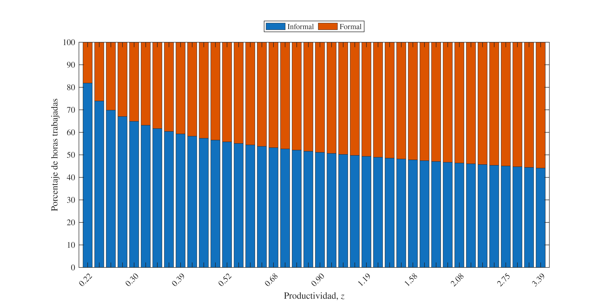

*Figura 1: Composición de la oferta laboral por nivel de productividad z (margen intensivo) en la calibración final. Cada barra muestra la fracción de horas destinadas al sector formal (azul) e informal (naranja) para cada estado de productividad discretizado.*

El Gráfico 1 presenta la oferta laboral destinada a los sectores formal e informal según el nivel de productividad de cada individuo. Los resultados muestran una relación positiva entre productividad y participación en el sector formal. Conforme aumenta z, los agentes destinan una proporción creciente de sus horas al trabajo formal, mientras que los individuos de menor productividad concentran sus horas en el sector informal.

Este sorting emerge de la interacción entre tres fuerzas: (i) la barrera $\kappa(z)$ que encarece el acceso al sector formal para agentes con z bajo; (ii) la diferencia salarial $w_F > w_I$ que hace más atractivo el sector formal; y (iii) las FOCs de la oferta laboral que equilibran la desutilidad marginal con el salario ponderado por la utilidad marginal del consumo.

El modelo genera una fracción agregada de horas en el sector informal de **51.7%**. Frente al promedio pre-COVID 2015-2019 (50.9%), la brecha es de apenas +0.8 puntos porcentuales. Frente al promedio de robustez COVID/post sin 2021 (55.9%), el modelo queda 4.2 puntos porcentuales por debajo. La comparación principal usa el benchmark pre-COVID porque otros momentos empíricos del documento, como el ratio de gasto 2015-2019 y el gradiente patrimonial 2017, también provienen de años previos a la pandemia.

## 5.3 Política de Ahorro y Endeudamiento

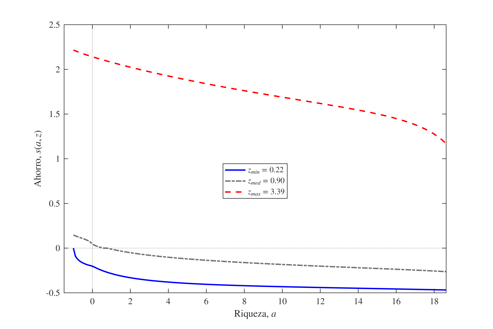

*Figura 2: Política de ahorro $\dot{a}(a, z)$. Línea positiva = ahorro; línea negativa = desahorro. Los diferentes trazos corresponden a distintos percentiles del proceso z. El cruce con $\dot{a} = 0$ determina el nivel de riqueza objetivo (target wealth) de cada agente.*

Los resultados indican que los agentes más productivos presentan mayor propensión a mantener activos positivos. La intensidad del ahorro disminuye gradualmente conforme aumenta el nivel de riqueza acumulada. En contraste, los agentes menos productivos muestran mayor tendencia a endeudarse, manteniendo niveles de deuda cercanos al límite $a_{\min} = -1$. El 11.8% de los hogares se encuentra en deuda (a < 0) en el equilibrio estacionario.

## 5.4 Distribución de Riqueza por Productividad

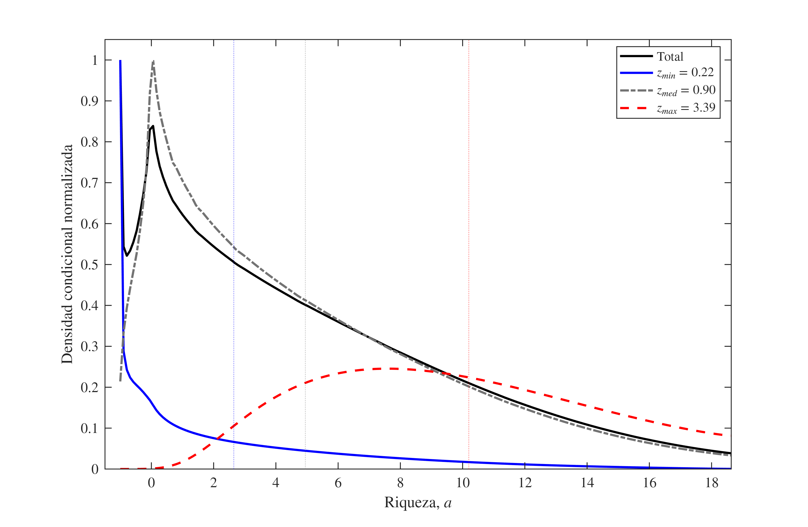

*Figura 3: Distribución estacionaria de riqueza g(a|z) para el tercil inferior (z bajo), el estado mediano y el tercil superior (z alto) del proceso de productividad.*

La distribución de riqueza muestra que los individuos con menor productividad están fuertemente concentrados en los niveles más bajos de riqueza, con una masa significativa en el límite de endeudamiento ($a_{\min} = -1$). Por el contrario, los individuos más productivos presentan una distribución más dispersa, con mayor acumulación en niveles intermedios y altos de riqueza.

Esta diferencia es el resultado endógeno de las decisiones óptimas de ahorro y endeudamiento: los agentes con mayor participación en el sector formal obtienen ingresos laborales más altos, pueden ahorrar más, y acceden al crédito en mejores condiciones ($\text{spread}(z)$ más bajo). Los agentes informales-dominantes, en cambio, obtienen menores ingresos, recurren más al crédito (con spreads más altos), y enfrentan mayores dificultades para acumular riqueza.

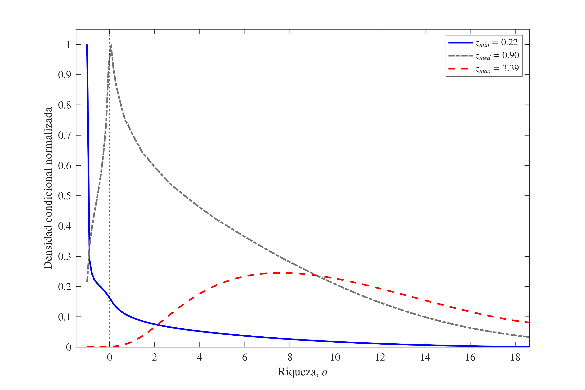

*Figura 3b: Distribución de activos/riqueza por nivel de productividad z. La masa de agentes de baja productividad se concentra en niveles bajos de activos, mientras que los estados de mayor productividad tienen mayor densidad en riqueza positiva.*

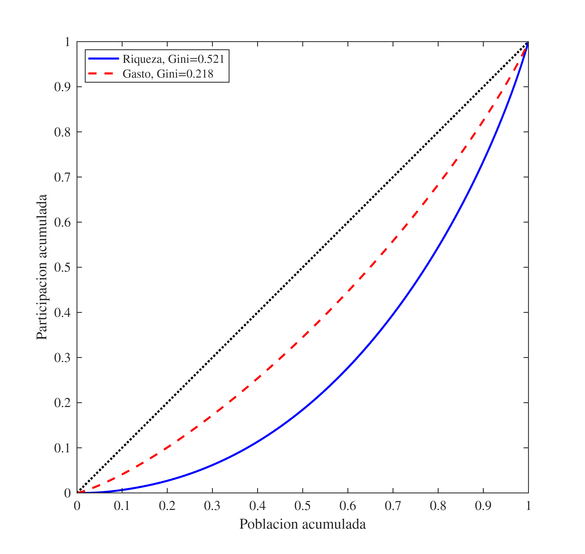

*Figura 3c: Curvas de Lorenz y coeficientes de Gini del equilibrio estacionario. El gráfico resume la desigualdad generada por la distribución conjunta de riqueza, consumo y productividad.*

El modelo genera un Gini de activos netos de 0.521 y un Gini de consumo de 0.218. Estos valores no deben compararse mecánicamente con el indicador SI.POV.GINI del Banco Mundial, que para Perú registra 40.1 en 2024 (40.7 en 2023) y mide desigualdad de ingreso o consumo según la encuesta primaria utilizada por la Plataforma de Pobreza y Desigualdad. En este trabajo, el Gini del Banco Mundial funciona como referencia macroeconómica externa, mientras que el Gini de activos del modelo describe la desigualdad endógena de riqueza financiera dentro del equilibrio estacionario.

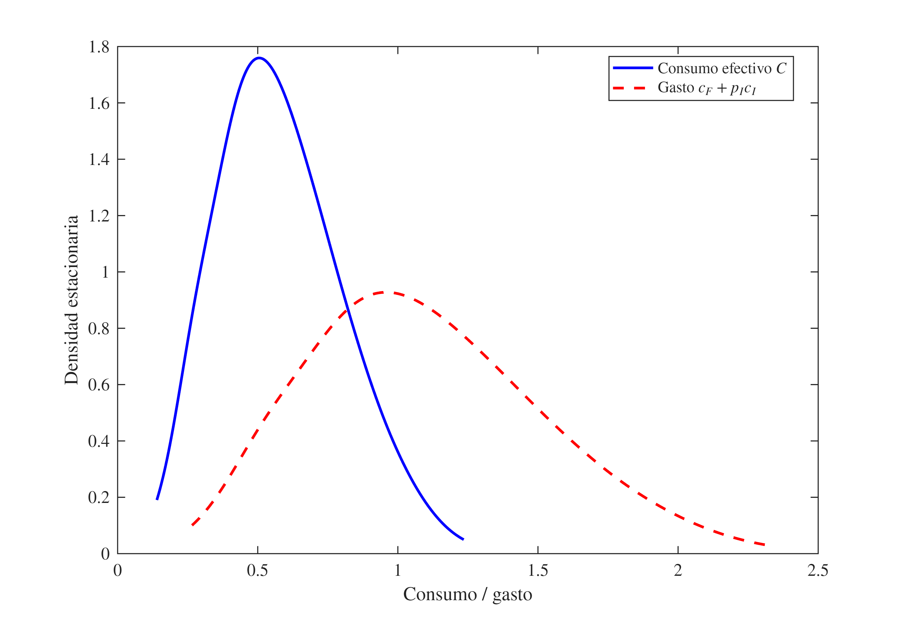

*Figura 3d: Distribución del consumo efectivo y del gasto total del hogar ($c_F + p_I c_I$). La comparación permite distinguir el índice CES de consumo del gasto monetario observado en ambos bienes.*

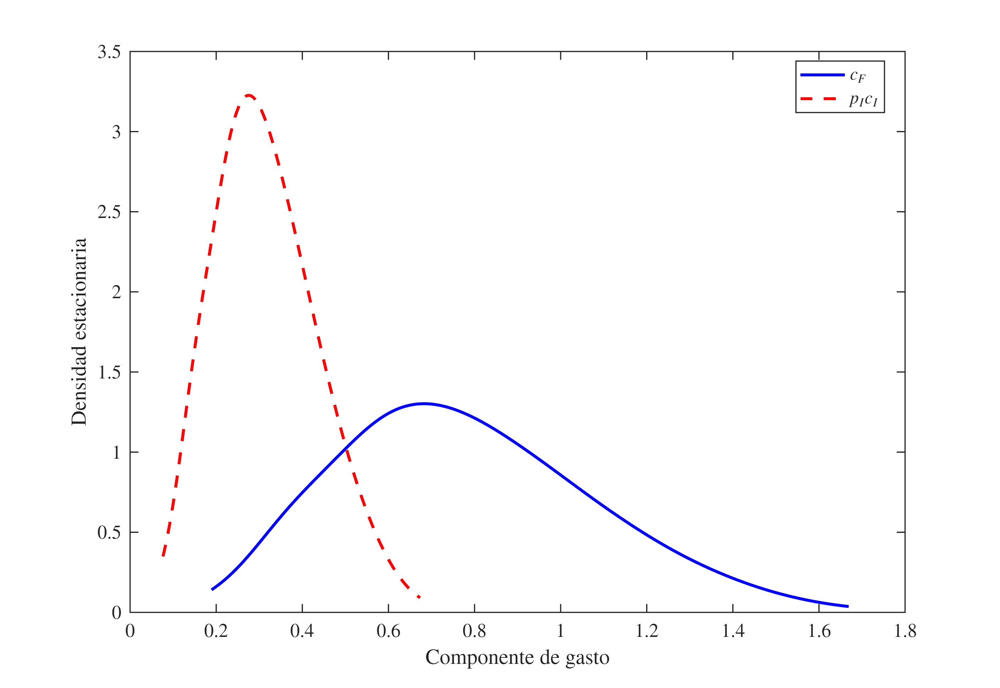

*Figura 3e: Distribución del consumo formal $c_F$ y del gasto informal $p_I c_I$. La figura muestra la composición del gasto entre bienes formales e informales para toda la distribución estacionaria.*

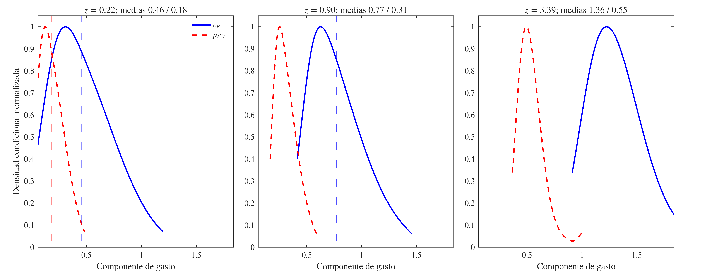

*Figura 3f: Distribución del consumo formal e informal por grupos de productividad z. El gráfico permite comparar cómo cambia la composición de consumo entre agentes de baja, media y alta productividad.*

## 5.5 Composición del Ingreso por Quintil de Riqueza

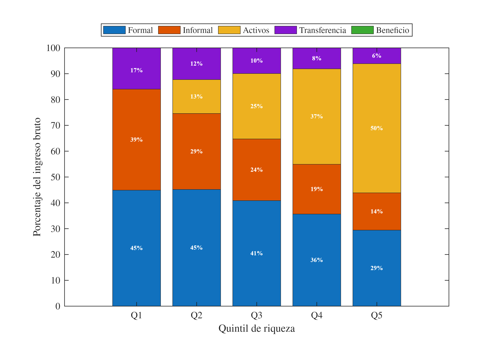

*Figura 4: Descomposición porcentual del ingreso por quintil de riqueza. El ingreso laboral formal (azul), el ingreso laboral informal (naranja), el rendimiento de activos (verde) y las transferencias del gobierno (rojo) se apilan para cada quintil.*

El Gráfico 4 revela que la fuente de ingreso que más distingue a los quintiles superiores de los inferiores es precisamente el **ingreso laboral formal**. Los quintiles de menor riqueza dependen proporcionalmente más del ingreso informal y de las transferencias, mientras que los quintiles altos concentran una mayor participación del ingreso formal y del rendimiento de activos. Este resultado es fundamental para evaluar la hipótesis de la investigación.

## 5.6 Gradiente de Informalidad por z y Probabilidad de Deuda

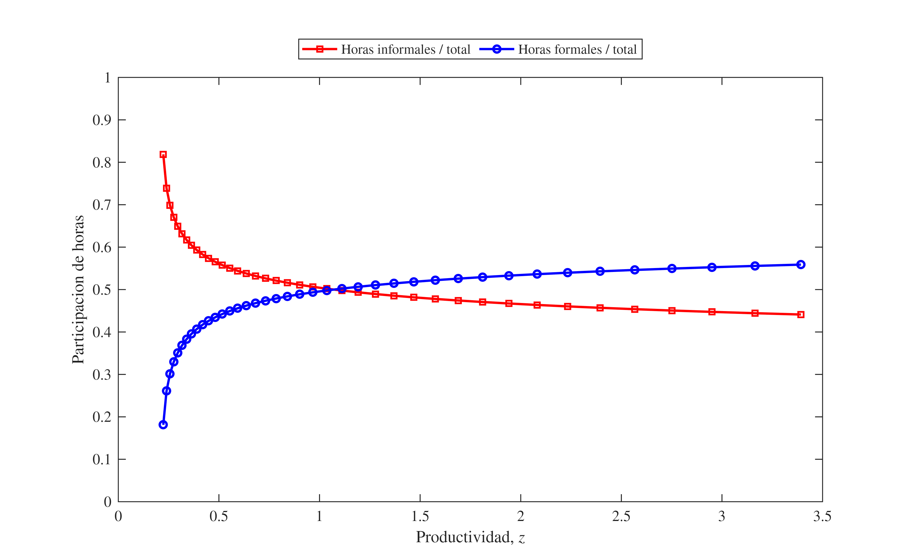

*Figura 5: Tasa de horas informales por estado de productividad z (promediado sobre la distribución de riqueza). El modelo genera un gradiente decreciente: mayor informalidad para z bajo.*

El modelo genera el sorting cualitativo correcto: los agentes con baja productividad trabajan más en el sector informal. La tasa de formalidad en el estado z más alto supera en 37.8 puntos porcentuales a la del estado z más bajo ($T_{kz,\text{modelo}} = 37.8\%$ vs. dato $= 38.6\%$).

## 5.7 Distribución del Gasto por Condición de Formalidad

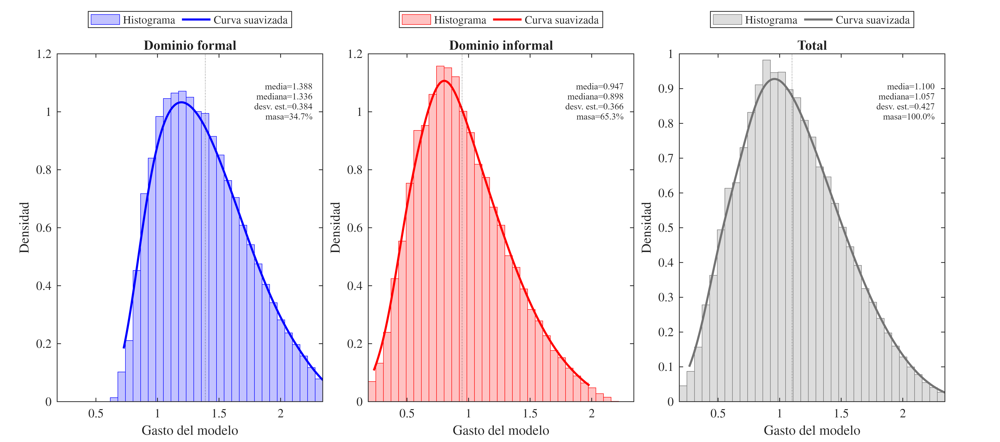

*Figura 6a: Densidad kernel del gasto total (cF + pI·cI) para hogares clasificados como formal-dominantes (>50% horas en formal) vs. informal-dominantes (<50% horas en formal). El modelo captura la brecha pero la subestima.*

**Leyenda de clasificación:** en el modelo, un hogar/estado se clasifica como **formal-dominante** si las horas formales superan a las horas informales ($\ell_F > \ell_I$), equivalente a una participación formal mayor a 50% del tiempo laboral total. Se clasifica como **informal-dominante** si las horas informales son mayores o iguales a las formales ($\ell_I \geq \ell_F$). Esta regla usa el margen intensivo del modelo; no es una clasificación extensiva de empleo principal.

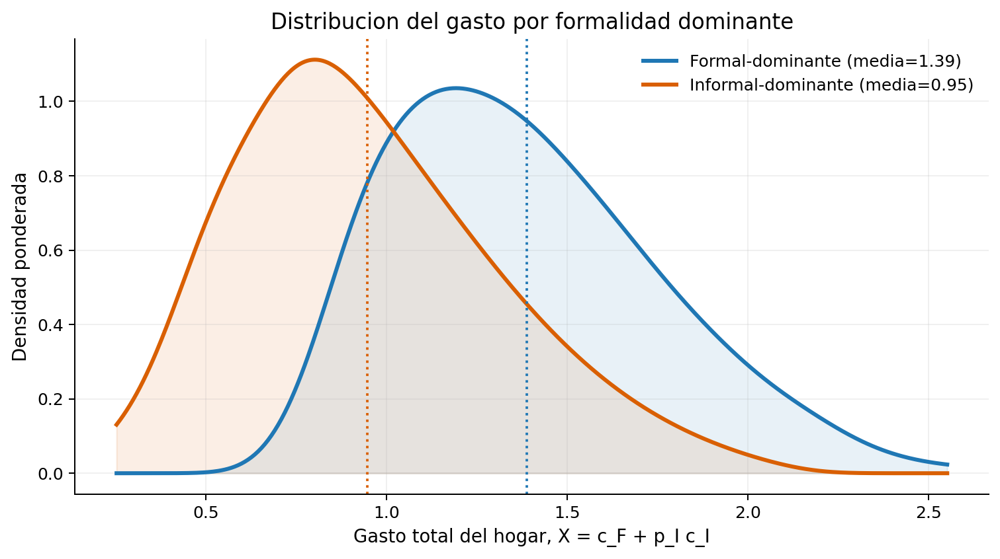

*Figura 6b: Versión superpuesta de la distribución del gasto total para hogares formal-dominantes e informal-dominantes. Ambas densidades se presentan en el mismo lienzo para facilitar la comparación de ubicación, dispersión y solapamiento.*

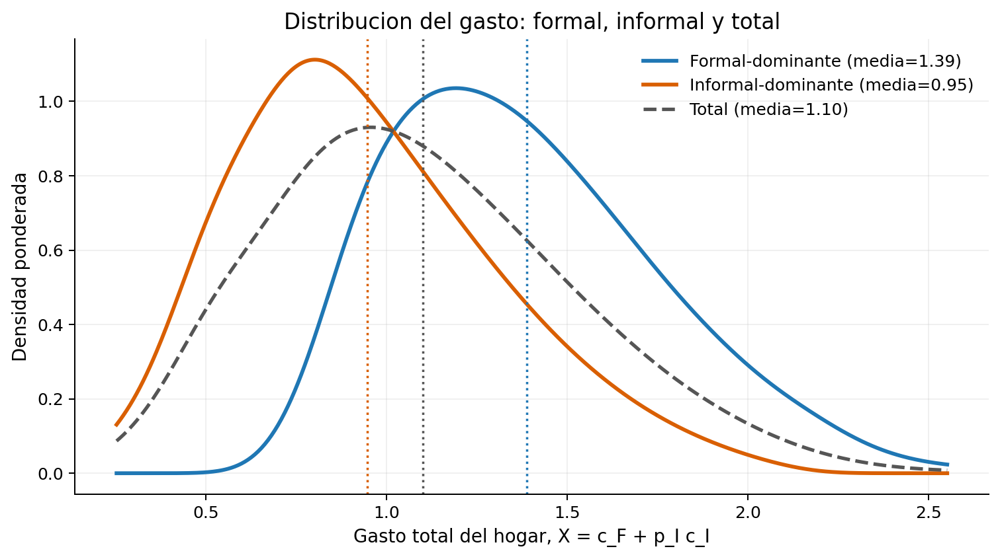

*Figura 6c: Distribución del gasto total para hogares formal-dominantes, informal-dominantes y el total de la economía. La línea total permite ubicar la mezcla agregada entre ambos grupos.*

El ratio de gasto promedio entre hogares formal-dominantes e informal-dominantes es $T_{\text{gasto},\text{modelo}} = 1.465$ (dato: 1.913). El modelo captura cualitativamente la brecha pero la subestima en magnitud. Esto sugiere que existen otras fuentes de heterogeneidad en el gasto (capital humano, composición del hogar, acceso a servicios públicos) que el modelo no incorpora.

Como validación empírica complementaria, el Anexo D reporta las distribuciones y tablas ENAHO 2015-2019 de gasto ajustado por formalidad del jefe de hogar. Ese anexo muestra que el gasto de hogares con jefe formal es sistemáticamente mayor y más disperso que el de hogares con jefe informal. Esta evidencia se usa como chequeo visual; el target principal mantiene la clasificación intensiva por horas dominantes y gasto mensual per cápita, con $T_{\text{gasto},\text{dato}} = 1.913$.

## 5.8 Mercado de Activos y Equilibrio General

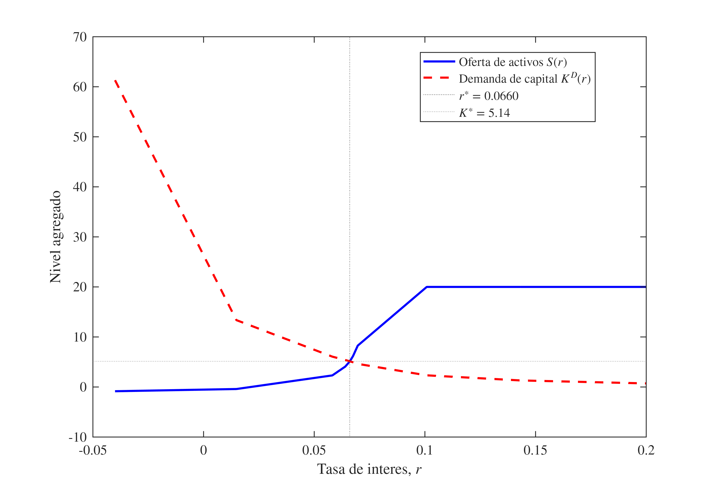

*Figura 7: Curvas de oferta de ahorro agregado S(r) y demanda de capital K_D(r). La intersección determina el equilibrio: r\* = 6.6%, K\* = 5.14 (en unidades de normalización).*

El equilibrio general se alcanza a r\* = 6.6%, con precio del bien informal $p_I = 0.928 < 1$ (bien informal más barato que el formal, como se requiere por consistencia económica), y ratio salarial neto T1 = 2.33 (próximo al dato de 2.30).

\newpage

# 6. DISCUSIÓN

## 6.1 Trampa de Pobreza: ¿Supuesto o Resultado?

Una pregunta central para la evaluación del modelo es si el mecanismo de baja acumulación (o "trampa de pobreza") es un **supuesto de diseño** o un **resultado endógeno**. La respuesta es matizada y requiere distinguir qué impone el modelo por construcción y qué emerge del equilibrio.

### 6.1.1 Lo que el modelo impone por supuesto

El modelo impone tres elementos exógenos que crean las condiciones para el mecanismo:

1. **Barrera de acceso $\kappa(z)$:** La función $\kappa(z) = \kappa_{z1} \cdot \left(\frac{z_{\max}-z}{z_{\max}-z_{\min}}\right)$ es una función decreciente en $z$ por construcción. El parámetro $\kappa_{z1} = 0.38$ se calibra para replicar $T_{kz} = 38.6\%$, pero la forma funcional (barrera mayor para z bajo) es un supuesto del modelo. Esto representa costos de formalización regulatoria, requisitos educativos y fricciones de selección, no una característica endógena emergente.
2. **Prima de deuda $\text{spread}(z)$:** Análogamente, $\text{spread}(z)$ es una cuña decreciente en z impuesta exógenamente para capturar que las entidades financieras perciben mayor riesgo en agentes de baja productividad. El valor χ = 0.02 se calibra con datos de spreads crediticios, pero la forma funcional es un supuesto.
3. **Brecha salarial $w_F > w_I$:** La diferencia tecnológica entre sectores ($A_F > A_I$) garantiza por supuesto que el sector formal paga más. Esto no emerge de la decisión de las firmas en equilibrio sino de los parámetros de productividad calibrados externamente.

Estos tres supuestos crean un entorno en el que los agentes con z bajo enfrentan simultáneamente: (a) mayor costo de acceso al sector formal, (b) mayor spread si se endeudan, y (c) menores salarios si trabajan en el sector informal. Nada de esto es un resultado; es la arquitectura del modelo.

### 6.1.2 Lo que emerge como resultado endógeno

Dados los supuestos anteriores, el modelo genera endógenamente:

1. **Sorting laboral por productividad:** La concentración de horas informales en agentes con z bajo no es impuesta, sino el resultado de las FOCs de optimización de los hogares. Los agentes eligen óptimamente sus horas en cada sector, y el gradiente $\kappa(z)$ junto con la diferencia salarial determina la solución de esquina que implica mayor informalidad para z bajo.
2. **Distribución diferencial de riqueza:** La distribución estacionaria g(a, z) que muestra mayor concentración de pobres entre los informales-dominantes emerge del equilibrio de la ecuación KF. No se impone directamente: resulta de la interacción dinámica entre las políticas óptimas de ahorro, la estructura de ingresos y la distribución del proceso z.
3. **Retroalimentación pobreza-informalidad:** El mecanismo circular (baja riqueza $\rightarrow$ urgencia de consumo $\rightarrow$ mayor informalidad $\rightarrow$ menores ingresos $\rightarrow$ menor riqueza futura) emerge del modelo. En el equilibrio estacionario, los agentes con z bajo y a cercano a $a_{\min}$ no pueden "escapar" de la informalidad porque sus ingresos apenas cubren su consumo mínimo y el pago de spreads. Esta dinámica no se impone; resulta de la solución del HJB y la distribución estacionaria.
4. **Magnitud de la trampa:** Qué fracción de agentes queda "atrapada", cuánta riqueza menos acumulan en promedio, y cuánto contribuye la informalidad a la desigualdad total: estos son resultados cuantitativos que dependen de la calibración y del equilibrio general.

### 6.1.3 Evaluación de la hipótesis

La hipótesis del trabajo (que la informalidad genera una trampa de baja acumulación) se **confirma parcialmente** como resultado endógeno. El modelo muestra que:

- Los agentes con z bajo y alta informalidad acumulan en promedio menos riqueza (observable en Figura 3)
- La composición del ingreso de los quintiles inferiores está sesgada hacia el sector informal (Figura 4)
- Existe retroalimentación: la baja riqueza limita el escape de la informalidad

Sin embargo, estos resultados deben interpretarse con cuidado: el mecanismo es **condicional a** los supuestos de $\kappa(z)$ y $\text{spread}(z)$. Un modelo sin estas cuñas podría generar distribuciones más homogéneas. La trampa de pobreza, por tanto, es un resultado endógeno **condicional a supuestos de diseño que tienen respaldo empírico** (barreras documentadas de acceso al sector formal, spreads crediticios diferenciados por riesgo).

## 6.2 Labor Endógeno como Canal de Auto-Aseguramiento

En modelos HA estándar sin oferta laboral (Aiyagari, 1994), el único mecanismo de auto-aseguramiento es el **ahorro precautorio** (motivo Bewley): los agentes acumulan activos como buffer frente a shocks de z. La incorporación de oferta laboral endógena introduce un **canal adicional de seguro**.

### 6.2.1 El mecanismo

Cuando el shock de productividad z cae, el agente puede responder de tres maneras:

1. Desahorrar (reducir a, canal de activos)
2. Aumentar la oferta de trabajo en algún sector (canal de labor endógeno)
3. Reducir consumo (absorber el shock)

Con oferta laboral endógena, el agente puede compensar parcialmente la caída de ingresos **aumentando las horas trabajadas**. En particular, dado el sistema de FOCs separables:

$$
\ell_F^* = \left(\frac{V_a (1-\tau) w_F z}{\psi_F}\right)^{\phi}, \qquad \ell_I^* = \left(\frac{V_a w_I \theta z^{\nu_I}}{\psi_I}\right)^{\phi}
$$

cuando z cae, $\ell_F^*$ y $\ell_I^*$ también caen directamente (vía el término $z$ y $z^{\nu_I}$). Sin embargo, la caída en ingresos eleva la urgencia de consumo ($V_a$ aumenta), lo que presiona al alza la oferta de trabajo a través del término $V_a$. Este efecto de sustitución parcial entre ahorro y trabajo como mecanismo de ajuste es el canal de seguro laboral.

### 6.2.2 Implicancias para el modelo

Pijoan-Más (2006) demuestra formalmente que la oferta laboral flexible **reduce el ahorro precautorio** porque los hogares pueden sustituir buffer de activos por mayor oferta laboral durante malos shocks. En nuestro modelo, esto implica:

1. **Menor acumulación de activos en equilibrio** que en el modelo equivalente sin labor endógeno. La distribución g(a, z) está "más hacia la izquierda" que en Aiyagari sin labor.
2. **Menor Gini de riqueza** que el que resultaría sin el canal de labor, porque el seguro laboral comprime parcialmente las diferencias.
3. **Reducción de la severidad de la trampa de pobreza:** El canal de labor permite que incluso los agentes con z bajo puedan trabajar más en el sector informal para compensar su baja productividad, suavizando (pero no eliminando) el mecanismo de baja acumulación.

### 6.2.3 Limitaciones del canal en el sector informal

Sin embargo, el canal de seguro laboral tiene una limitación importante en nuestro modelo dual. Para los agentes con z bajo:

- El acceso al sector formal está restringido por $\kappa(z) > 0$, lo que limita la cantidad de horas adicionales que pueden ofrecer al sector de mayor salario.
- El sector informal tiene menor productividad ($w_I < w_F$) y rendimientos decrecientes ($\beta_I < 1$), lo que significa que aumentar horas informales genera ingresos crecientes pero a tasa decreciente.
- La prima de deuda $\text{spread}(z) > 0$ encarece adicionalmente el crédito, reduciendo la capacidad de inter-temporizar el consumo.

En consecuencia, el canal de seguro es **asimétrico**: actúa con mayor efectividad para agentes de alta productividad (que pueden reasignar horas al sector formal con altos salarios) que para agentes de baja productividad (limitados al sector informal con menor compensación). Esta asimetría es coherente con la evidencia de Bacher, Grübener y Nord (2025) sobre el Added Worker Effect, que muestra mayor flexibilidad laboral en hogares de mayores ingresos.

## 6.3 Limitaciones del Modelo

### 6.3.1 Ausencia del Margen Extensivo

La limitación más importante del modelo es que opera **exclusivamente en el margen intensivo**. Todos los agentes asignan horas a ambos sectores simultáneamente ($\ell_F \geq 0$, $\ell_I \geq 0$), y la solución puede ser una solución interior o de esquina, pero nunca una decisión discreta de participación sectorial.

En la realidad, la mayoría de los trabajadores son 100% formales o 100% informales en su empleo principal. Las estadísticas de EPEN/ENAHO reportan esta clasificación discreta. Esto genera la discrepancia masiva en T6: el modelo arroja 4.4% para el ratio de informalidad Q1 vs. Q5 en horas, mientras que el dato observado es 53.0%.

Esta brecha no indica un mal desempeño del modelo en su dimensión de diseño (margen intensivo), sino que refleja la limitación fundamental de no modelar la decisión discreta de participación. Para reproducir T6 correctamente se requeriría incorporar un costo fijo de entrada al sector formal, que generaría corner solutions donde algunos agentes eligen no trabajar formalmente.

Sin embargo, esta extensión es incompatible con el marco HACT en su formulación estándar. La ecuación de Hamilton-Jacobi-Bellman requiere que la función de valor V(a, z) sea continua y diferenciable en el espacio de estados, condición que sostiene el esquema de diferencias finitas *upwind* (Achdou et al., 2022). Un costo fijo de participación introduce una no-convexidad en el conjunto de elección: el agente decide entre $\ell_F = 0$ (sin costo) o $\ell_F > 0$ (paga el costo fijo), generando potencialmente una discontinuidad o quiebre (*kink*) en V. Esto transforma el problema en un control de impulso (*impulse control*), que requiere métodos de variational inequalities o quasi-variational inequalities, una extensión computacionalmente diferente y considerablemente más demandante que la resolución estándar del HJB.

Una extensión natural consistiría en incorporar heterogeneidad discreta: agentes que en cada período eligen su sector principal (margen extensivo) y luego deciden cuánto trabajar en ese sector (margen intensivo). Este diseño captura tanto la estadística de EPEN (extensivo) como la de la Cuenta Satélite (intensivo), pero requiere salir del marco HACT estándar.

### 6.3.2 Ausencia de Heterogeneidad de Firmas

El modelo representa el sector formal mediante una única firma representativa y el sector informal mediante otra única firma representativa. En la realidad:

- Las firmas formales difieren en tamaño, sector productivo, acceso a capital externo y tecnología.
- Las microempresas informales son extremadamente heterogéneas: desde vendedores ambulantes hasta fabricantes informales con múltiples empleados.
- No existe matching heterogéneo entre firmas y trabajadores.

Esta simplificación impide capturar mecanismos importantes: la movilidad entre tipos de firmas, los retornos crecientes asociados a firmas formales más grandes, o el rol de las redes sociales en el acceso a empleo formal. Futuras investigaciones podrían incorporar heterogeneidad de firmas siguiendo la literatura de búsqueda y emparejamiento (Meghir, Narita y Robin, 2015).

### 6.3.3 Utilidad Separable en el Trabajo de Cada Sector

La especificación de utilidad separable

$$
u = \frac{C^{1-\gamma}-1}{1-\gamma} - \psi_F \frac{\ell_F^{1+1/\phi}}{1+1/\phi} - \psi_I \frac{\ell_I^{1+1/\phi}}{1+1/\phi}
$$

tiene ventajas computacionales importantes: las FOCs de trabajo pueden resolverse analíticamente (o mediante bisección en el caso con restricción KKT), eliminando la necesidad de búsqueda numérica multidimensional. Sin embargo, impone restricciones económicas relevantes:

1. **Independencia entre decisiones laborales:** La oferta de trabajo en el sector formal no depende directamente de las horas en el sector informal (y viceversa). En la realidad, las horas en ambos sectores pueden ser complementos o sustitutos imperfectos según la naturaleza del trabajo.
2. **Independencia entre consumo y ocio:** La separabilidad implica que la elasticidad de sustitución intertemporal del consumo (gobernada por γ) es independiente de la decisión laboral. Esta separación simplifica el análisis pero ignora posibles complementariedades entre consumo y trabajo (por ejemplo, transporte y alimentación asociados al trabajo formal).
3. **Sin aprendizaje ni capital humano:** Las horas en el sector formal no generan acumulación de habilidades que aumenten la productividad futura, lo que podría amplificar el mecanismo de trampa de pobreza a través de un canal de capital humano adicional.
4. **$\psi$ asimétrico como proxy de barreras regulatorias por hora:** La calibración requiere $\psi_F > \psi_I$ para que el modelo genere una fracción de horas informales (T4) consistente con el dato principal pre-COVID de 50.9% y razonablemente cercana a la robustez sin 2021 de 55.9%. Esta asimetría puede interpretarse como un *proxy* reducido del costo de cumplimiento regulatorio por hora en el sector formal: registro SUNAT, aportes ESSALUD, contratos laborales y obligaciones de planilla incrementan el "costo efectivo" de cada hora formal más allá del salario neto. El trabajador informal no incurre en estos costos, lo que en el margen intensivo se refleja como una menor desutilidad por hora informal (Levy, 2008; Perry et al., 2007). En rigor, sin embargo, este diferencial es una fricción de *participación* (no de *intensidad*) y su representación correcta requeriría un margen extensivo explícito con costo fijo de entrada al sector formal. La asimetría $\psi_F > \psi_I$ constituye por tanto una aproximación de forma reducida que permite calibrar el modelo intensivo al target T4 sin comprometer la trazabilidad analítica de las FOCs.

La utilidad separable en los dos tipos de trabajo, junto con el proceso OU para z, permite resolver el modelo en escala macroeconómica (I × Nz = 200 × 40 = 8,000 estados) con tiempos computacionales manejables (~75 minutos para la corrida rápida). Sustituciones por formas más generales (por ejemplo, GHH como en Greenwood, Hercowitz y Huffman, 1988) requieren resolución numérica de la oferta laboral en cada punto de la grilla, aumentando sustancialmente el costo computacional.

### 6.3.4 Otras Limitaciones Reconocidas

- **Análisis estático:** El modelo opera en estado estacionario. No puede analizar transiciones ante shocks (pandemia, reformas tributarias) ni evaluar dinámicas de ajuste. Extensiones mediante MIT shocks (transición entre estados estacionarios) están documentadas como agenda futura.
- **Ausencia de dimensión de género:** El modelo no diferencia por género. La informalidad femenina (73.3%) supera a la masculina (69.1%) según EPEN (INEI, 2024), y las brechas salariales de género son documentadas por Guillén y Huarancca (2024). Una extensión natural incorporaría tipos de agentes diferenciados por género.
- **Sin heterogeneidad sectorial dentro del informal:** El sector informal se modela mediante una única tecnología. La heterogeneidad entre agricultura, construcción, comercio y servicios informales (todos con grados de informalidad y productividades distintas) no es capturada.
- **Capital informal:** La calibración actual incluye capital en el sector informal (αI = 0.22), pero no modela la decisión de inversión informal explícitamente. El stock de capital informal se determina por la condición de vaciado del mercado de bienes, no por una decisión intertemporal de los empresarios informales.

\newpage

# 7. EXTENSIONES FUTURAS

El modelo desarrollado en esta investigación constituye una primera aproximación para estudiar la relación entre informalidad, acumulación patrimonial y distribución de riqueza en una economía con agentes heterogéneos. No obstante, existen varias extensiones que permitirían enriquecer el análisis y acercarlo con mayor precisión a la realidad del mercado laboral peruano.

## 7.1 Margen extensivo: elección ocupacional discreta

Una primera extensión consiste en incorporar una decisión ocupacional discreta entre empleo formal, empleo informal, autoempleo o no participación. En el modelo actual, los hogares asignan tiempo entre sectores mediante un margen continuo de oferta laboral. Sin embargo, en la práctica, muchos trabajadores enfrentan decisiones discretas asociadas a costos fijos de entrada, búsqueda de empleo, requisitos administrativos o barreras de acceso a empleos formales. Incorporar un costo fijo de entrada al sector formal permitiría modelar una decisión binaria de participación y capturar mejor la selección de agentes entre formalidad e informalidad, incluyendo la magnitud del gradiente T6 que el modelo intensivo no puede replicar.

Esta extensión, sin embargo, requiere salir del marco HACT estándar. Los costos fijos de participación introducen no-convexidades que pueden generar discontinuidades en la función de valor V(a, z), incompatibles con el esquema de diferencias finitas *upwind* que sustenta la resolución del HJB. El problema se transforma en un control de impulso (*impulse control*), tratable mediante *quasi-variational inequalities* (Bensoussan y Lions, 1984), una clase de problema computacionalmente más demandante y metodológicamente distinta. Una alternativa computacionalmente más accesible sería modelar el margen extensivo mediante tasas de llegada de oportunidades de empleo formal (proceso de Poisson), siguiendo el marco de búsqueda de Meghir, Narita y Robin (2015), que sí es compatible con el HJB continuo.

## 7.2 Heterogeneidad por género y hogares con dos miembros

Una segunda extensión relevante consiste en introducir heterogeneidad por género. El modelo podría incorporar dos tipos de agentes —mujeres y hombres— con distintos procesos de productividad, costos de acceso al sector formal, preferencias laborales, restricciones de tiempo y cargas de trabajo no remunerado. Esta extensión permitiría analizar la brecha de informalidad por género documentada en EPEN (informalidad femenina 73.3% vs. masculina 69.1%) y evaluar cómo las fricciones laborales afectan diferencialmente la acumulación de activos. Además, se podría pasar de hogares unitarios a hogares con dos miembros para estudiar mecanismos de seguro intrahogar. Bacher, Grübener y Nord (2025) desarrollan un modelo de ciclo de vida con hogares de dos miembros y fricciones de búsqueda laboral para estudiar el *Added Worker Effect*, definido como la entrada al mercado laboral de un cónyuge ante la pérdida de empleo de la pareja, lo que ofrece una referencia metodológica directa.

## 7.3 Múltiples sectores informales

El modelo actual agrega la informalidad en una sola tecnología con rendimientos decrecientes. Sin embargo, la evidencia para Perú muestra una marcada heterogeneidad sectorial: la informalidad es particularmente elevada en agricultura, construcción, comercio y servicios, cada uno con productividades, elasticidades y costos de capital distintos. Una extensión natural sería reemplazar el sector informal único por varios sectores con tecnologías diferenciadas. Esto permitiría estudiar si la informalidad rural o primaria responde a mecanismos distintos de la informalidad urbana, y calibrar separadamente los parámetros de cada subsector usando datos de la Cuenta Satélite de la Economía Informal (INEI, 2024). También es posible modelar la dinamica de las firmas, entrar y salir del mercado (modelo de firmas incumbentes y entrantes) como lo planteó  Hopenhayn (1992).

## 7.4 Transición dinámica y MIT shocks

Una extensión importante consiste en resolver la transición dinámica del modelo ante un choque inesperado (*MIT shock*). Esto permitiría analizar episodios como una reforma tributaria, una reducción de costos de formalización, una expansión del crédito o una crisis como la pandemia de 2020. La metodología estándar consiste en: (i) calibrar el estado estacionario inicial; (ii) definir el nuevo estado estacionario bajo la política analizada; (iii) resolver hacia atrás la HJB y hacia adelante la distribución de agentes; y (iv) graficar las trayectorias de consumo, ahorro, empleo formal, empleo informal, deuda y precios. Esta estructura es directamente compatible con el código MATLAB del modelo actual, siguiendo el *template* de Achdou et al. (2022) y los ejemplos de transición publicados por Moll (n.d.). Cabe señalar que los MIT shocks asumen expectativas racionales, por lo que los agentes anticipan perfectamente el choque.

## 7.5 Validación externa con otros países

Una quinta extensión consiste en recalibrar el modelo para otras economías latinoamericanas, como Colombia, México o Chile. Esta validación cruzada permitiría evaluar si los mecanismos identificados para Perú son específicos del contexto nacional o si reflejan patrones más generales de economías con alta informalidad. La comparación con Colombia es especialmente relevante por la literatura existente sobre informalidad y desigualdad de riqueza (Granda y Hamann, 2015); México permite contrastar los resultados en una economía con alta informalidad urbana y fuerte segmentación laboral; Chile puede funcionar como *benchmark* regional con mayor formalización y sistema financiero más desarrollado.

## 7.6 Modelo de ciclo de vida

Una extensión de mayor alcance consistiría en introducir una estructura de ciclo de vida. En el modelo actual, los agentes no se diferencian por edad ni enfrentan decisiones explícitas de acumulación para la vejez. Un modelo de ciclo de vida permitiría estudiar cómo la informalidad afecta la acumulación de activos desde la juventud hasta el retiro, considerando perfiles de productividad, ahorro y endeudamiento que varían con la edad. Esta extensión sería especialmente útil para analizar la acumulación patrimonial de trabajadores informales que no acceden a pensiones contributivas. Albertini, Fairise y Terriau (2021) ofrecen una referencia cercana al estudiar salud, riqueza e informalidad a lo largo del ciclo de vida en Sudáfrica.

## 7.7 Capital humano, activos líquidos e ilíquidos

Otra extensión consiste en ampliar el espacio de estados incorporando capital humano y tipos distintos de activos. Por un lado, los agentes podrían decidir invertir en capital humano, que se acumula y deprecia en el tiempo, lo que permitiría estudiar cómo la informalidad afecta los incentivos a capacitarse y cómo las brechas de capital humano refuerzan las diferencias de productividad. Por otro lado, distinguir entre activos líquidos e ilíquidos capturaría mejor la capacidad de los hogares para suavizar shocks: los hogares informales podrían tener menor acceso a activos líquidos o enfrentar mayores costos de conversión de patrimonio ilíquido en consumo, amplificando su vulnerabilidad ante shocks laborales o financieros. Como referencia computacional, Kaplan, Moll y Violante (2018) desarrollan un modelo HACT con activos líquidos e ilíquidos (*HANK*) que podría adaptarse al contexto dual del presente modelo.

## 7.8 Fricciones de búsqueda y matching laboral

Una extensión que dotaría de mayor microfundamento a las cuñas κ(z) y spread(z) consiste en incorporar fricciones de búsqueda y emparejamiento laboral. En lugar de imponer una barrera de acceso estática κ(z), esta extensión modelaría explícitamente tasas de llegada de ofertas de empleo formal que dependen de la productividad del trabajador, separaciones laborales y transiciones entre sectores. Esto permitiría endogenizar el gradiente de formalidad por productividad (Tkz) que actualmente se calibra con la cuña κ(z). Como punto de partida, Meghir, Narita y Robin (2015) desarrollan un modelo de *matching* para economías en desarrollo con sector informal que podría integrarse en la estructura HACT del presente trabajo. Moll (n.d.) también publica un código de búsqueda laboral con ahorro precautorio en tiempo continuo.

## 7.9 Dinámicas de formación de hogares

Una extensión más ambiciosa sería modelar explícitamente la formación y disolución de hogares, incluyendo decisiones de matrimonio, divorcio y oferta laboral conjunta. Esto sería especialmente útil para estudiar cómo la composición del hogar afecta la acumulación patrimonial en contextos de informalidad. Yanagimoto (2026) reformula un modelo de matrimonio y divorcio en tiempo continuo utilizando métodos HACT, demostrando la factibilidad de integrar estas decisiones familiares en la estructura computacional del presente trabajo.

## 7.10 Choques climáticos, productividad e informalidad

Una extensión adicional consistiría en incorporar shocks climáticos (en particular variaciones de temperatura) como determinantes de la productividad laboral. Esta extensión permitiría analizar cómo episodios de calor extremo o cambios persistentes en la temperatura afectan la productividad de los trabajadores, las transiciones entre empleo formal e informal y la desigualdad de riqueza. La motivación proviene de literatura reciente que combina modelos HACT con fricciones laborales y shocks climáticos: Goenka, Liu, Nguyen y Pang (2025) desarrollan un modelo con búsqueda dirigida para estudiar cómo fluctuaciones de productividad inducidas por temperatura afectan la desigualdad laboral y patrimonial, con aplicación a Vietnam. En el presente modelo, una forma directa de incorporar este canal sería permitir que la productividad del sector informal (más expuesto al clima por concentrar agricultura, construcción y comercio ambulatorio) responda a un shock climático agregado, evaluando si la informalidad actúa como mecanismo de absorción o como amplificador de la vulnerabilidad de los hogares de menor riqueza.

\newpage

# 8. CONCLUSIONES

El presente trabajo analizó la relación entre informalidad y distribución de la riqueza en el Perú mediante un modelo de equilibrio general con agentes heterogéneos en tiempo continuo, oferta laboral endógena y dos sectores productivos. Este enfoque permitió estudiar de manera conjunta las decisiones de los hogares, las firmas y el gobierno en una economía caracterizada por elevada informalidad laboral.

Los resultados del modelo replican razonablemente los agregados primarios de informalidad intensiva: $T_{4,\text{modelo}} = 51.7\%$ (dato pre-COVID 2015-2019: 50.9%; robustez sin 2021: 55.9%), $T_{5,\text{modelo}} = 18.8\%$ (dato: 19.0%) y $T_{kz,\text{modelo}} = 37.8\%$ (dato: 38.6%). El ratio salarial formal/informal neto (2.33) es próximo al dato de referencia (2.30). El equilibrio se alcanza a r\* = 6.6% y $p_I = 0.928$, consistentes con las restricciones de coherencia económica (r\* < ρ = 7.3%; $p_I < 1$).

La hipótesis central (que la informalidad genera un mecanismo de baja acumulación que acentúa la desigualdad) se confirma parcialmente como resultado endógeno. Los agentes con menor productividad presentan menor riqueza media, mayor probabilidad de endeudamiento y menor participación en el sector formal. Sin embargo, este mecanismo es **condicional a supuestos de diseño** (barreras κ(z) y spread(z) decrecientes en z) que tienen respaldo empírico pero son exógenos al modelo. La magnitud de la trampa (qué fracción de agentes queda atrapada y cuánta riqueza menos acumulan) sí emerge como resultado endógeno del equilibrio general.

Un hallazgo adicional es que la **oferta laboral endógena actúa como canal de auto-aseguramiento parcial** frente a shocks de productividad, en línea con Pijoan-Más (2006). Este canal reduce el ahorro precautorio y la severidad de la trampa, pero opera asimétricamente: es más efectivo para agentes de alta productividad (con acceso al sector formal de alta remuneración) que para agentes de baja productividad (confinados al sector informal de menor compensación).

La principal limitación del modelo es la ausencia del **margen extensivo** en la decisión ocupacional. Esta limitación explica la subestimación masiva de T6 (gradiente de informalidad por quintil de riqueza: 4.4% modelo vs. 53.0% dato). Extensiones futuras deberían incorporar una elección discreta de participación sectorial para capturar tanto la estadística extensiva (EPEN) como la intensiva (Cuenta Satélite). Otras extensiones relevantes incluyen: diferenciación por género, heterogeneidad sectorial dentro del informal, dinámicas de transición tipo MIT shock, y endogeneización del capital humano como determinante de la barrera de acceso al sector formal.

\newpage

# REFERENCIAS BIBLIOGRÁFICAS

Achdou, Y., Han, J., Lasry, J.M., Lions, P.L. & Moll, B. (2022). Income and Wealth Distribution in Macroeconomics: A Continuous-Time Approach. *Review of Economic Studies*, 89(1), 45-86.

Aiyagari, S.R. (1994). Uninsured idiosyncratic risk and aggregate saving. *The Quarterly Journal of Economics*, 109(3), 659-684.

Albertini, J., Fairise, X. & Terriau, A. (2021). Health, Wealth, and Informality over the Life Cycle. *Journal of Economic Dynamics and Control*, 129, 104170.

Bacher, A., Grübener, P., & Nord, L. (2025). Joint search over the life cycle. *Journal of Monetary Economics*, 150.

Banco Mundial. (2026). *Gini index (SI.POV.GINI) - Peru*. World Development Indicators / Poverty and Inequality Platform. https://datos.bancomundial.org/indicador/SI.POV.GINI?locations=PE

Buera, F.J., Kaboski, J.P. & Shin, Y. (2011). Finance and Development: A Tale of Two Sectors. *American Economic Review*, 101(5), 1964-2002.

Castillo, P. & Rojas, Y. (2014). Capital humano y crecimiento económico en el Perú. *Revista Estudios Económicos*, 28, BCRP.

Cerqueiro, G., Degryse, H. & Ongena, S. (2011). Rules versus discretion in loan rate setting. *Journal of Financial Intermediation*, 20(4), 503-529.

Céspedes, N. & Rendón, S. (2012). La elasticidad de oferta laboral de Frisch en economías con alta movilidad laboral. BCRP Working Paper 2012-017.

Céspedes, N., Aquije, M.-E., Sánchez, A. & Vera-Tudela, R. (2014). Productividad sectorial en el Perú: Un análisis a nivel de firmas. *Revista Estudios Económicos*, 28, BCRP.

ComexPerú (2024). Desempeño del Mercado Laboral Peruano: Resultados 2023. Reporte Laboral.

De Soto, H. (1986). *El otro sendero: La revolución informal*. Lima: Editorial El Barranco.

Engbom, N., Gonzaga, G., Moser, C. & Olivieri, R. (2022). Earnings Inequality and Dynamics in the Presence of Informality: The Case of Brazil. *Quantitative Economics*, 13(4), 1405-1446.

Flabbi, L. & Tejada, M. (2022). Working and Saving Informally: The Link between Labor Market Informality and Financial Exclusion. CHILD Working Paper.

Galindo, H., Ledesma, A., Yépez, L. & Salinas, C. (2024). Informality and Wealth Distribution: A Heterogeneous Agent Model. BCRP Documento de Trabajo N° 2024-005.

Göbel, K., Grimm, M. & Lay, J. (2013). Capital Returns, Household Heterogeneity and the Informal Sector. BCRP Working Paper 2013-001.

Gomes, D.B., Iachan, F.S. & Santos, C. (2020). Labor Earnings Dynamics in a Developing Economy with a Large Informal Sector. *Journal of Economic Dynamics and Control*, 113, 103854.

Granda, C. & Hamann, F. (2015). Informality, Saving and Wealth Inequality in Colombia. IDB Working Paper.

Guillén, S., & Huarancca, M. (2024). Navigating the post-pandemic landscape: An analysis of the gender wage gap in Peru. BCRP, Departamento de Políticas Sociales y Regionales.

Hallegatte, S. (2014). Economic Resilience: Definition and Measurement. World Bank Policy Research Working Paper, 6852.

Heathcote, J., Storesletten, K. & Violante, G.L. (2009). Quantitative macroeconomics with heterogeneous households. *Annual Review of Economics*, 1(1), 319-354.

Hong, S. (2022). MPCs in an Emerging Economy: Evidence from Peru. *Journal of International Economics*.

Hopenhayn, Hugo A. 1992. “Entry, Exit, and Firm Dynamics in Long Run Equilibrium.” Econometrica, 60(5): 1127–50.

Horvath, J. (2017). Business Cycles, Informal Economy, and Interest Rates in Emerging Countries. *Journal of Macroeconomics*, 54, 345-363.

Huggett, M. (1993). The Risk-Free Rate in Heterogeneous-Agent Incomplete-Insurance Economies. *Journal of Economic Dynamics and Control*, 17(5-6), 953-969.

INEI (2018). *Perú: Evolución de los indicadores de empleo e ingresos por departamento, 2007-2017*. Instituto Nacional de Estadística e Informática. Fuente de datos: Encuesta Nacional de Hogares. https://www.inei.gob.pe/media/MenuRecursivo/publicaciones_digitales/Est/Lib1537/libro.pdf

INEI (2022). *Producción y empleo informal en el Perú: Cuenta Satélite de la Economía Informal 2007-2021*. Instituto Nacional de Estadística e Informática. Fuente de datos: Cuentas Nacionales y ENAHO. https://www.inei.gob.pe/media/MenuRecursivo/publicaciones_digitales/Est/Lib1878/libro.pdf

INEI (2024). *Perú: Comportamiento de los indicadores del mercado laboral a nivel nacional y en 26 ciudades. Primer trimestre 2024*. Instituto Nacional de Estadística e Informática. Fuente de datos: Encuesta Permanente de Empleo Nacional. https://www.inei.gob.pe/media/MenuRecursivo/boletines/02-informe-tecnico-empleo-nacional-primer-trimestre-2024.pdf

INEI (2025). *Producción y empleo informal en el Perú: Cuenta Satélite de la Economía Informal 2022-2024*. Instituto Nacional de Estadística e Informática.

Loayza, N. (2008). Causas y consecuencias de la informalidad en el Perú. *Revista Estudios Económicos*, 15, 43-64. BCRP.

Loayza, N. (2016). Informality in the Process of Development and Growth. *The World Economy*, 39(12), 1856-1916.

Marcet, A., Obiols-Homs, F. & Weil, P. (2007). Incomplete markets, labor supply and capital accumulation. *Journal of Monetary Economics*, 54(8), 2621-2635.

Matos Mar, J. (1984). *Desborde popular y crisis del Estado: El nuevo rostro del Perú en la década de 1980*. Lima: Instituto de Estudios Peruanos.

Meghir, C., Narita, R. & Robin, J.M. (2015). Wages and informality in developing countries. *American Economic Review*, 105(4), 1509-1546.

Moll, B. (n.d.). *Codes: A collection of codes that solve a number of heterogeneous agent models in continuous time using finite difference methods*. https://benjaminmoll.com/codes/

OIT (2025). Panorama Laboral 2024: América Latina y el Caribe. Organización Internacional del Trabajo.

Proyecto COSME. (2025). *Informalidad en el Perú: caracterización del empleo informal. Empleo informal en Perú - 2023. Principales características y elementos diferenciales en base a la Encuesta Permanente de Empleo Nacional - EPEN 2023*. Universidad Internacional de La Rioja. https://gruposinvestigacion.unir.net/cosme/wp-content/uploads/sites/139/2025/05/INFORMALIDAD-EN-PERU-2023-Caracterizacion-del-empleo-informal.pdf

Pijoan-Más, M. (2006). Precautionary savings or working longer hours? *Review of Economic Dynamics*, 9(2), 326-352.

Prebisch, R. (1949). *El desarrollo económico de la América Latina y algunos de sus principales problemas*. CEPAL.

Restrepo-Echavarría, P. (2014). Macroeconomic Volatility: The Role of the Informal Economy. *European Economic Review*, 70, 454-469.

Rossini, R. (2015). Peru's recent economic history. En A. Santos & A. Werner (Eds.), *Peru: Staying the Course of Economic Success*. International Monetary Fund.

Stiglitz, J. & Weiss, A. (1992). Credit Rationing in Markets with Imperfect Information. *American Economic Review*, 71(3), 393-410.

\newpage

# ANEXOS

## Anexo A: Figuras de Datos Empíricos

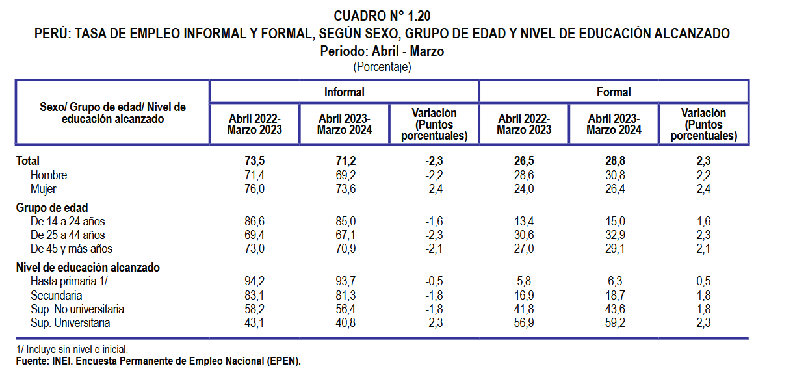

*Figura F1: Tasa de empleo informal y formal según sexo, grupo de edad y nivel educativo alcanzado. Fuente: INEI (2024), Cuadro N.° 1.20, Encuesta Permanente de Empleo Nacional (EPEN), periodo abril 2023-marzo 2024. Esta figura documenta el fuerte gradiente educativo de la informalidad: la tasa informal cae desde 93.7% para población con primaria o menor nivel hasta 40.8% para quienes alcanzan educación superior universitaria.*

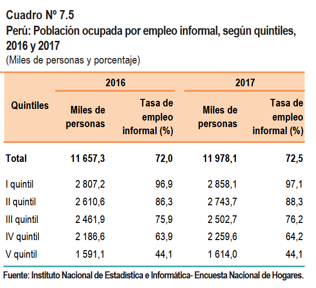

*Figura F2: Población ocupada por empleo informal según quintiles, 2016 y 2017. Fuente: INEI (2018), Cuadro N.° 7.5, elaborado con la Encuesta Nacional de Hogares. El cuadro muestra que la tasa de empleo informal es decreciente por quintil: en 2017 alcanza 97.1% en el I quintil y 44.1% en el V quintil. Esta brecha motiva el target T6 usado como validación externa del modelo.*

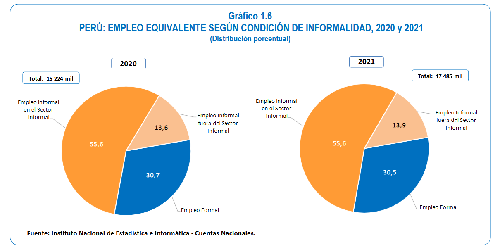

*Figura F3: Empleo equivalente según condición de informalidad, 2020 y 2021. Fuente: INEI (2022), Gráfico 1.6, Cuenta Satélite de la Economía Informal 2007-2021. Nota metodológica: esta figura usa empleo equivalente de Cuentas Nacionales, no personas ocupadas directamente. Por ello se usa como contexto macroeconómico y no se mezcla como target directo con los cuadros de población ocupada.*

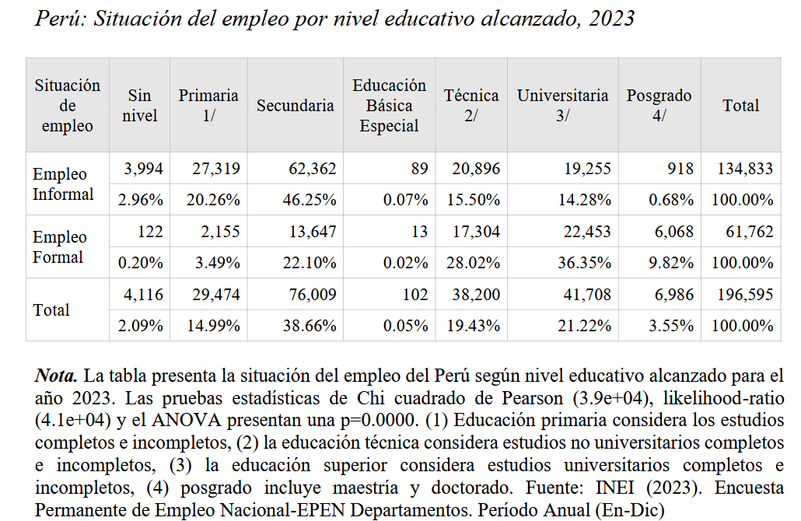

*Figura F4: Situación del empleo por nivel educativo alcanzado, Perú 2023. Fuente: Proyecto COSME (2025), informe académico "Informalidad en el Perú: caracterización del empleo informal. Empleo informal en Perú - 2023", elaborado con EPEN 2023. La tabla refuerza la relación entre educación e informalidad: dentro del empleo informal, la mayor concentración se ubica en secundaria (46.25%) y primaria (20.26%), mientras que el empleo formal se concentra más en educación técnica, universitaria y posgrado.*

## Anexo B: Parámetros Técnicos del Modelo Computacional

| Parámetro técnico       | Valor                                     | Descripción                         |
| :------------------------ | :---------------------------------------- | :----------------------------------- |
| I (grilla riqueza)        | 200 (rápido) / 500 (producción)         | Puntos en grilla de activos          |
| Nz (grilla productividad) | 40                                        | Estados discretos del proceso OU     |
| amin                      | −1                                       | Límite inferior de endeudamiento    |
| amax                      | 20                                        | Límite superior de activos          |
| maxit (HJB)               | 40                                        | Máximo de iteraciones HJB           |
| crit (convergencia)       | 1×10⁻⁵                                 | Criterio de convergencia             |
| max_iter_pI               | 20                                        | Máx. iteraciones precio informal    |
| Tiempo de cómputo        | ~30 min (rápido) / ~11.2 h (producción) | En hardware estándar (i7, 32GB RAM) |

## Anexo C: Correcciones Respecto a Versiones Anteriores del Documento

Las siguientes correcciones fueron incorporadas en esta versión con respecto al borrador previo:

**Tabla 1 (parámetros).** Se corrigió la participación del capital formal de $\alpha_K = 0.35$ a $\alpha_K = 0.573$, siguiendo Céspedes et al. (2014). También se reemplazó la tecnología informal previa por $\alpha_I = 0.22$ y $\beta_I = 0.619$, consistentes con la calibración interna y la referencia de Göbel et al. (2013).

**Proceso de productividad.** Se reemplazó la normalización $\rho_z = 1.0$ por $\rho_z = 0.861$, estimado a partir de Hong (2022) con panel ENAHO 2004-2016.

**Preferencias y tasa de descuento.** Se corrigió la especificación previa $\gamma = 2$, $\rho = 0.05$ por utilidad logarítmica ($\gamma = 1$) y $\rho = 0.073$, consistente con una tasa de equilibrio $r^* = 6.6\%$.

**Targets de calibración.** El target T5 se actualizó de 18.5% a 19.0%, usando la Cuenta Satélite del INEI. El target principal T4 se fijó en 50.9%, promedio ENAHO 2015-2019; el promedio 2020, 2022 y 2023 excluyendo 2021 se mantiene como robustez y equivale a 55.9%.

**Resultados de la Sección 5.** Se eliminó la interpretación de 70.2% como resultado del modelo. Esa cifra corresponde al margen extensivo de EPEN, mientras que el modelo reproduce un margen intensivo de horas: $T4_{\text{modelo}} = 51.7\%$.

**PBI informal y conclusiones.** Se actualizó $T5_{\text{modelo}}$ de 18.3% a 18.8%. Las conclusiones ahora reportan $T4_{\text{modelo}} = 51.7\%$, $T5_{\text{modelo}} = 18.8\%$ y $Tkz_{\text{modelo}} = 37.8\%$.

**Discusión de limitaciones.** Se amplió la discusión sobre trampa de pobreza, canal de seguro laboral, ausencia de margen extensivo, ausencia de heterogeneidad de firmas y utilidad separable.

## Anexo D: Distribuciones de Gasto por Formalidad del Jefe de Hogar, ENAHO 2015-2019

Este anexo presenta una validación empírica complementaria basada en ENAHO 2015-2019. La clasificación empírica se realiza por formalidad del jefe de hogar; en hogares unipersonales se usa la formalidad de la persona única. Esta definición no es el target principal del modelo, pero permite contrastar visualmente si el gasto observado de hogares formales e informales se ordena de manera consistente con el mecanismo calibrado.

El gasto ajustado BnD se define como gasto total del hogar menos gasto en equipamiento del hogar, televisión, electrodomésticos, muebles y enseres. Los resultados usan factores de expansión `factor07`.

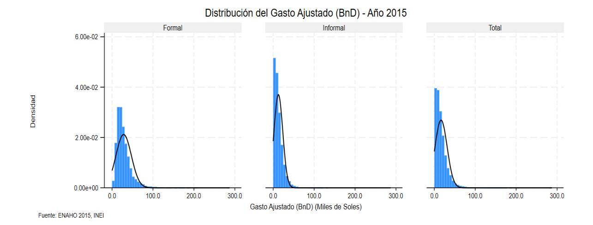

*Figura D1: Distribución del gasto ajustado BnD por formalidad del jefe de hogar, 2015. Panel izquierdo: hogares con jefe formal; panel central: hogares con jefe informal; panel derecho: total de hogares.*

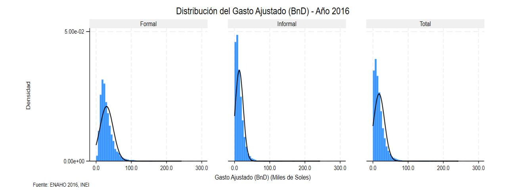

*Figura D2: Distribución del gasto ajustado BnD por formalidad del jefe de hogar, 2016.*

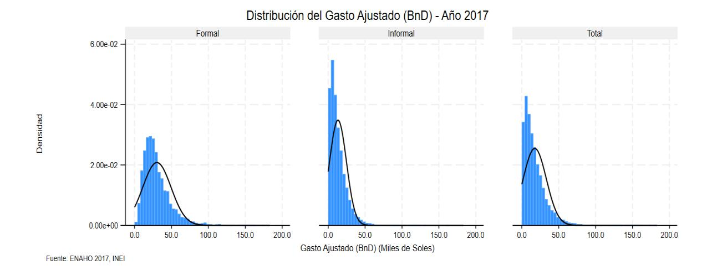

*Figura D3: Distribución del gasto ajustado BnD por formalidad del jefe de hogar, 2017.*

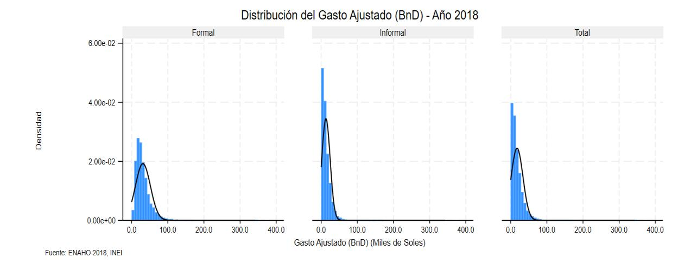

*Figura D4: Distribución del gasto ajustado BnD por formalidad del jefe de hogar, 2018.*

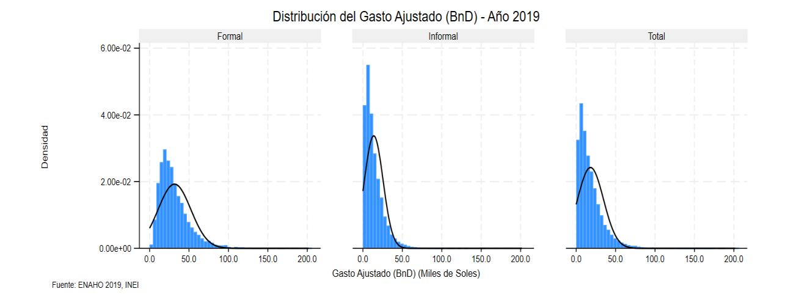

*Figura D5: Distribución del gasto ajustado BnD por formalidad del jefe de hogar, 2019.*

**Tabla D1: Gasto ajustado BnD promedio expandido por formalidad del jefe de hogar (soles corrientes)**

| Año  | Gasto formal | Gasto informal | Gasto total | Diferencia |
|------|-------------:|---------------:|------------:|-----------:|
| 2015 | 29415.92 | 14760.78 | 44176.70 | 14655.14 |
| 2016 | 30972.93 | 15338.69 | 46311.62 | 15634.24 |
| 2017 | 31848.96 | 15376.82 | 47225.78 | 16472.14 |
| 2018 | 32644.25 | 15532.38 | 48176.63 | 17111.87 |
| 2019 | 33214.85 | 15854.65 | 49069.50 | 17360.20 |

**Tabla D2: Desviación estándar expandida del gasto ajustado BnD por formalidad del jefe de hogar**

| Año  | SD gasto formal | SD gasto informal | SD total | Diferencia SD |
|------|----------------:|------------------:|---------:|--------------:|
| 2015 | 19358.52 | 11849.74 | 16049.43 | 7508.78 |
| 2016 | 20058.44 | 12487.90 | 16707.61 | 7570.54 |
| 2017 | 20402.88 | 12787.84 | 17026.54 | 7615.04 |
| 2018 | 21335.79 | 12896.09 | 17628.46 | 8439.70 |
| 2019 | 22095.74 | 12641.63 | 18000.45 | 9454.11 |

**Tabla D3: Gasto total del hogar (GASHOG1D) promedio expandido por formalidad del jefe de hogar (soles corrientes)**

| Año  | Gasto formal | Gasto informal | Gasto total | Diferencia |
|------|-------------:|---------------:|------------:|-----------:|
| 2015 | 31416.98 | 15600.98 | 47017.96 | 15816.00 |
| 2016 | 32950.20 | 16210.21 | 49160.41 | 16739.99 |
| 2017 | 33891.77 | 16235.75 | 50127.52 | 17656.02 |
| 2018 | 34767.52 | 16409.78 | 51177.30 | 18357.74 |
| 2019 | 35441.96 | 16749.94 | 52191.90 | 18692.02 |

**Tabla D4: Desviación estándar expandida del gasto total del hogar (GASHOG1D) por formalidad del jefe de hogar**

| Año  | SD gasto formal | SD gasto informal | SD total | Diferencia SD |
|------|----------------:|------------------:|---------:|--------------:|
| 2015 | 21232.80 | 12403.88 | 17388.04 | 8828.92 |
| 2016 | 21653.81 | 13148.32 | 17913.21 | 8505.49 |
| 2017 | 22023.69 | 13448.88 | 18247.13 | 8574.81 |
| 2018 | 23179.89 | 13532.90 | 18979.55 | 9646.99 |
| 2019 | 23806.03 | 13286.70 | 19277.75 | 10519.33 |

Fuente: ENAHO 2015-2019, INEI. La evidencia del anexo confirma que los hogares con jefe formal presentan mayor gasto promedio y mayor dispersión en todos los años, aunque esta clasificación por jefe de hogar se mantiene como validación visual y no como target vinculante del modelo.
